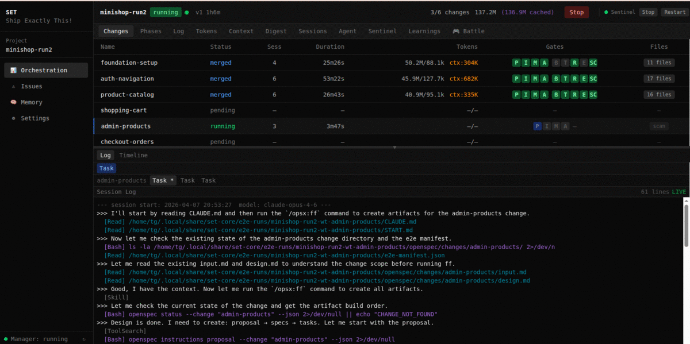
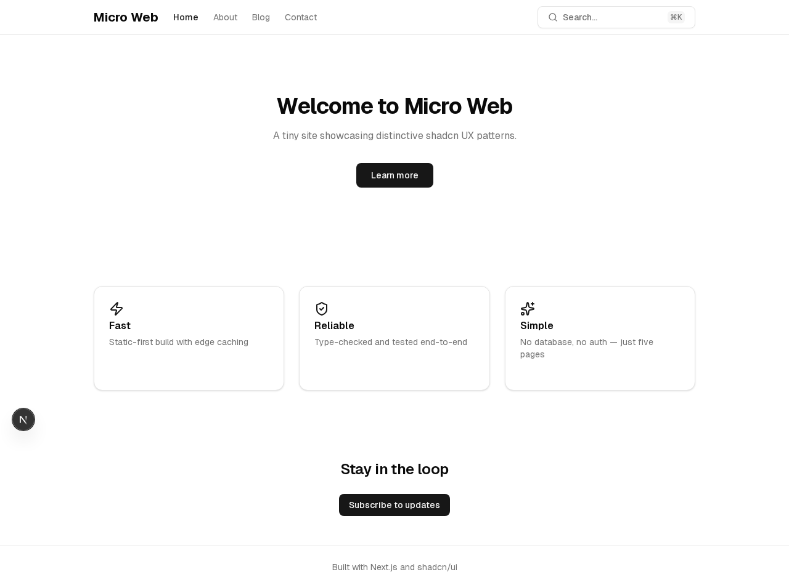
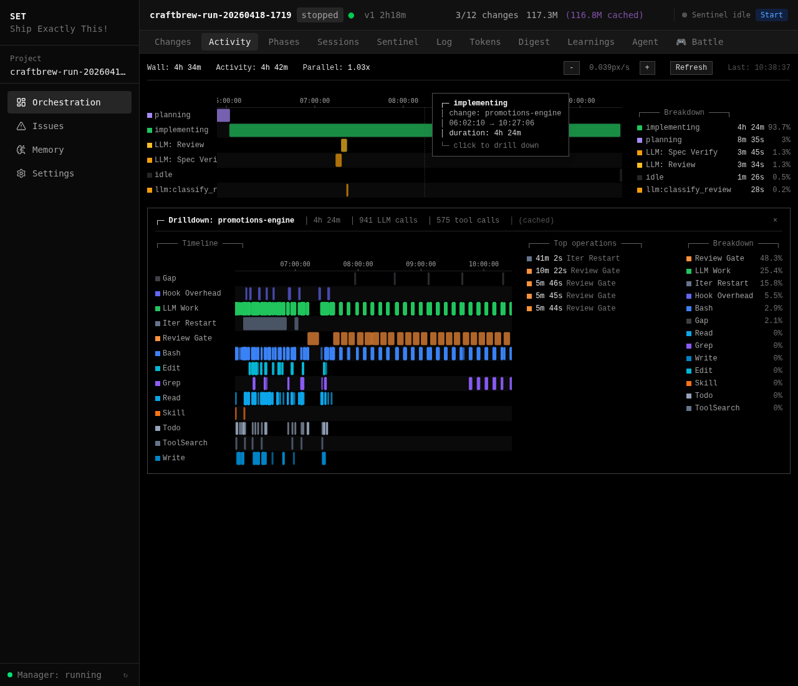
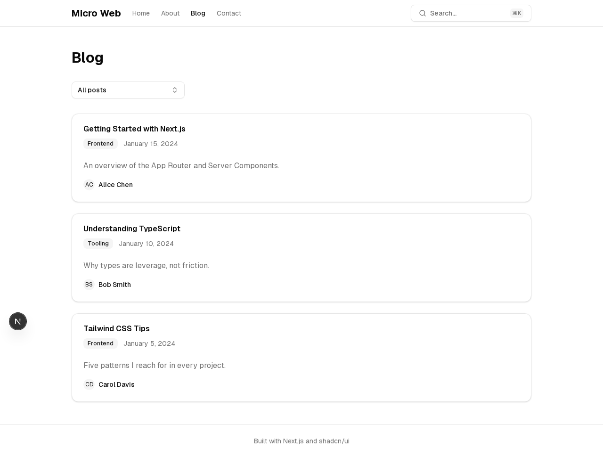
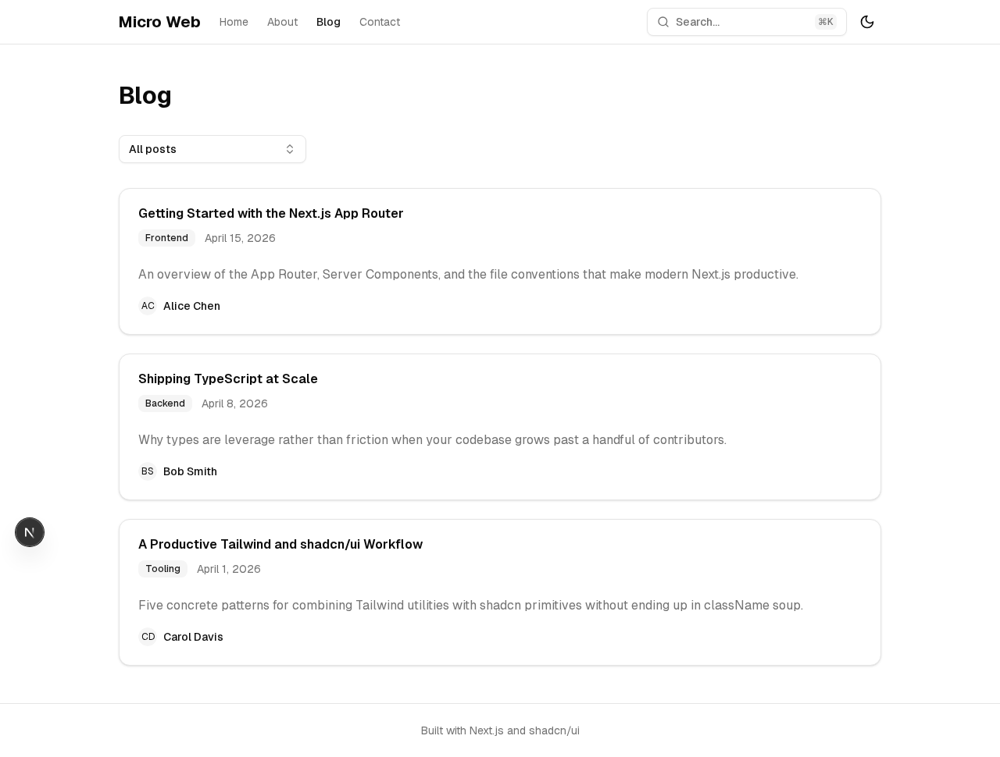

# set-core

**An experiment in structured AI development** — specs, quality gates, and parallel agents applied to Claude Code.

[](docs/release/alpha-release.md)
[](LICENSE)
[-lightgrey.svg)]()
[](https://setcode.dev)

I use Claude Code every day. It's great for writing code, but shipping software — coordinating parallel agents, testing, merging, recovering from failures — needs more structure. set-core is what I built around it: give it a markdown spec, it decomposes into independent changes, dispatches parallel agents in git worktrees, runs quality gates on each, and merges the results.

Every change goes through [OpenSpec](https://github.com/fission-ai/openspec) — a structured workflow (proposal → design → spec → tasks → code → verify) that gives agents contracts to work against instead of prompts to interpret. Quality gates are deterministic: exit codes, not LLM judgment.

Built with set-core, using set-core. This project was developed using its own orchestration pipeline.

> **This is an early alpha — a working experiment, not a finished product.** It works well enough that I use it daily, but expect rough edges. The sentinel auto-recovers from most of them. See [`docs/release/alpha-release.md`](docs/release/alpha-release.md) for the current state, known issues, and what's not yet implemented.
>
> Open source (MIT) — in case it's useful to someone else too.

**[Read the FAQ](https://setcode.dev/faq.html)** — how SET compares to Cursor, Devin, Kiro, Copilot, Augment Intent, and others. Honest comparison — what SET does well, where others are ahead.

---

## Repositories

| Repository | Description |
|------------|-------------|
| **[set-core](https://github.com/tatargabor/set-core)** | Core orchestration engine, web module, dashboard, CLI tools |
| [set-spec-capture](https://git.setcode.dev/root/set-spec-capture) | Capture specs from any source (web, PDF, conversation) |
| [set-voice-agent-delivery](https://github.com/tatargabor/set-voice-agent-delivery) | Voice agent project type — Soniox STT, Google TTS, spec-driven customer interaction |

---

## See It In Action

**An agent working on a change — debugging, testing, fixing:**

<p align="center">
  
</p>

**Input:** A markdown spec + a v0.app design export (or any Next.js-shaped design source)

<p align="center">
  
  &nbsp;
  
</p>

**Orchestration:** Phased execution, dependency DAG, quality gates on every change

<p align="center">
  
  &nbsp;
  
</p>

**Visibility:** See where every minute goes — agent sessions, LLM calls, tool executions, sub-agents, gates — all placed on a real-time axis. Click any implementing span to drill into its per-tool breakdown.

<p align="center">
  
</p>
<p align="center"><em>Activity timeline (top) — every change as a row, every gate and LLM call placed in time. Drilldown (below) — one implementing span expanded into per-tool, per-LLM-call, per-sub-agent breakdown with the longest operations called out.</em></p>

**Output:** Running application — built entirely from the spec, faithful to the design source

<p align="center">
  
  &nbsp;
  
</p>
<p align="center"><em>Spec + v0 design → parallel agents → quality gates (including design-fidelity) → working app. Zero intervention.</em></p>

---

## The Pipeline

```
spec.md ──► digest ──► decompose ──► parallel agents ──► verify ──► merge ──► done
```

<details>
<summary>What's actually happening under the hood</summary>

```
spec.md + design source (v0.app export → manifest, or design-snapshot.md)
  │
  ▼
┌───────────────────────────────────────────────────────────┐
│ Sentinel (autonomous supervisor)                          │
│  ├─ digests spec into requirements + domain summaries     │
│  ├─ decomposes into independent changes (DAG)             │
│  ├─ dispatches each to its own git worktree               │
│  ├─ monitors progress, restarts on crash                  │
│  ├─ merges verified results back to main                  │
│  └─ auto-replans until full spec coverage                 │
│                                                           │
│  Per change:                                              │
│  ┌──────────────────────────────────────────────────┐     │
│  │ Ralph Loop                                       │     │
│  │  ├─ OpenSpec artifacts (proposal → design → code) │     │
│  │  ├─ iterative implementation with tests           │     │
│  │  ├─ progress-based trend detection                │     │
│  │  └─ auto-pause on stall or budget limit           │     │
│  └──────────────────────────────────────────────────┘     │
│                                                           │
│  Quality gates (per change, before merge):                │
│  ┌──────────────────────────────────────────────────┐     │
│  │ Jest/Vitest → Build → Playwright E2E             │     │
│  │ → Code Review → Spec Coverage → Smoke Test       │     │
│  │ (gate profiles: per-change-type configuration)    │     │
│  └──────────────────────────────────────────────────┘     │
│                                                           │
│  Across all agents:                                       │
│  ┌──────────────────────────────────────────────────┐     │
│  │ Memory Layer                                     │     │
│  │  ├─ 5-layer hooks inject context per tool         │     │
│  │  ├─ agents learn from each other's work           │     │
│  │  └─ conventions survive across sessions           │     │
│  └──────────────────────────────────────────────────┘     │
└───────────────────────────────────────────────────────────┘
  │
  ▼
merged, tested, done
```

</details>

---

## Key Features

| | Feature | Description |
|---|---|---|
| :gear: | **Full Pipeline** | Spec to merged code — digest, decompose, dispatch, verify, merge — hands-off. [Guide](docs/guide/orchestration.md) |
| :shield: | **Quality Gates** | Test, build, E2E, code review, spec coverage, and smoke — deterministic, not LLM-judged. [Guide](docs/guide/orchestration.md) |
| :brain: | **Persistent Memory** | Hook-driven cross-session recall — agents learn from each other. Infrastructure saves, not voluntary. [Guide](docs/guide/memory.md) |
| :bar_chart: | **Web Dashboard** | Real-time monitoring — orchestration state, agents, tokens, issues, learnings. [Guide](docs/guide/dashboard.md) |
| :clipboard: | **OpenSpec Workflow** | Structured artifact flow (proposal → design → spec → tasks → code) minimizes hallucination. [Guide](docs/guide/openspec.md) |
| :wrench: | **Self-Healing** | Issue pipeline: detect → investigate → fix → verify. The sentinel diagnoses before it acts. [Guide](docs/guide/sentinel.md) |
| :jigsaw: | **Plugin System** | Project-type plugins add domain rules, gates, templates, and conventions. [Docs](docs/reference/plugins.md) |
| :art: | **Design Bridge** | v0.app export → manifest → per-change design slice → Tailwind tokens + shell components injected into every agent's context. [Guide](docs/guide/design-integration.md) |
| :chart_with_upwards_trend: | **Cross-Run Learnings** | Review findings and gate failures become rules for the next run. The system gets better with use. [Dashboard](docs/guide/dashboard.md) |
| :repeat: | **Account Manager** | Manage multiple Claude Code accounts — register, monitor usage, manually switch. [Docs](docs/account-manager.md) |

---

## Consumer Feedback Loop

set-core is battle-tested through consumer projects — E2E runs that exercise the full pipeline from spec to merged app. During these runs, agents discover and fix real problems: build gate failures, middleware bugs, test flakiness. **These fixes are framework-level insights that belong in set-core**, not just in the consumer project.

```
set-core (framework)                    consumer project (E2E run)
   │                                        │
   ├── set-project init ───────────────────►│  deploy rules, templates, gates
   │                                        │
   │                                        ├── agents build features
   │                                        ├── gates catch failures
   │                                        ├── ISS pipeline creates fixes  ◄── valuable!
   │                                        │
   │◄── set-harvest ───────────────────────┤  review + adopt framework fixes
   │                                        │
   ├── update planning rules, templates     │
   ├── set-project init ───────────────────►│  redeploy with improvements
```

**After every E2E run, harvest the fixes:**

```bash
set-harvest                          # scan all registered projects
set-harvest --project craftbrew-run-20260320-1445 # scan single project
set-harvest --dry-run                # preview without updating state
```

The harvest tool scans ISS fix commits chronologically, classifies them as framework-relevant or project-specific, and suggests where to adopt them (planning rules, templates, or core code). Each fix is reviewed interactively — no auto-adoption.

**Custom projects:** The harvest command runs from the **set-core repo**, not the consumer project. After an orchestration run completes on any registered project, switch to the set-core directory and run `set-harvest`. This is a manual step — the system cannot auto-adopt fixes without human review.

```bash
cd /path/to/set-core          # switch to set-core repo
set-harvest                    # review all registered projects
set-harvest --project my-app   # review single project
```

---

## Where We're Heading

Active development priorities:

| Direction | Goal | Status |
|-----------|------|--------|
| **Divergence reduction** | Eliminate remaining nondeterminism through template optimization, scaffold testing, and configuration distribution across core → module → scaffold → project layers | Measurably reduced for simple projects; complex projects still improving — tracked across paired E2E runs |
| **Build time optimization** | Reduce gate pipeline wall clock time — parallel gate execution, incremental builds, cached test results between changes | Currently sequential (Jest → Build → E2E → Review); exploring parallel gates where safe |
| **Session context reuse** | Reuse conversation context across Ralph Loop iterations and between related changes — reduce cold-start token overhead | Currently each iteration starts fresh; investigating warm-start from previous iteration's state |
| **Memory optimization** | Smarter recall — relevance scoring, dedup, consolidation. Lite-mode hooks for low-context sessions | Dedup, consolidation, and `SET_MEMORY_HOOKS=lite` mode operational; learning-to-rule conversion deferred |
| **Gate intelligence** | Per-change-type gate profiles that adapt based on historical pass rates and failure patterns | Gate profiles operational; adaptive thresholds planned |
| **Merge conflict prevention** | Proactive detection of cross-cutting file conflicts before they happen — schedule conflicting changes sequentially | Phase ordering works; file-level conflict prediction in research |

See [docs/learn/journey.md](docs/learn/journey.md) for the full development history and [docs/learn/lessons-learned.md](docs/learn/lessons-learned.md) for production insights driving these priorities.

---

## What We're Measuring

AI agents are nondeterministic — run the same prompt twice, get different results. The experiment here: does adding structure (specs, gates, templates) make the output converge?

| Challenge | Our Approach | Result |
|-----------|-------------|--------|
| **Output divergence** | [3-layer template system](docs/learn/journey.md) — templates lock structure, agents focus on logic | 83–87% structural convergence across paired runs ([report](tests/e2e/runs/minishop/run-16-vs-17.md)) |
| **Hallucination** | [OpenSpec workflow](docs/guide/openspec.md) — structured artifacts with requirements + acceptance criteria | Agents implement against spec, not imagination |
| **Quality roulette** | [Programmatic gates](docs/guide/orchestration.md) — exit codes, not LLM judgment. 7 gate types | Deterministic pass/fail |
| **Spec drift** | [Coverage tracking](docs/guide/openspec.md) — verifies "does it satisfy the spec?" not just "do tests pass?" | Auto-replan when coverage < 100% |
| **Failure recovery** | [Issue pipeline](docs/guide/sentinel.md) — detailed investigation before any fix. No guessing. | 30-second recovery, not hours |
| **Agent amnesia** | [Hook-driven memory](docs/guide/memory.md) — shared across worktrees, survives sessions | Zero voluntary saves → 100% capture via hooks |
| **Framework reliability** | [E2E scaffold testing](docs/learn/benchmarks.md) — the orchestrator tests itself | 30+ runs across 4 project scaffolds |

Structural convergence across paired runs: [83% minishop](tests/e2e/runs/minishop/run-16-vs-17.md), 87% micro-web. Schema equivalence at 100%, convention compliance at 100%. The remaining divergence is stylistic, not structural. Not perfect, but converging. [Full data →](docs/learn/journey.md)

---

## The Spec Is the Bottleneck

Writing a good spec takes effort. That's intentional — **the quality of the output depends on the quality of the input.** The trade-off SET makes: upfront structure for reliable results.

A good spec for SET includes:
- **Data model** — entities, fields, relationships, enums (becomes the Prisma schema)
- **Page layouts** — sections, column counts, component names (not vague descriptions)
- **Design tokens** — exact hex colors, font families, spacing values (or use [v0.app](https://v0.app) + `set-design-import` to pull a working Tailwind/shadcn export)
- **Auth & roles** — protected routes, user roles, registration flow
- **Seed data** — realistic names and content, not "Product 1"
- **i18n** — locales, framework, URL structure (if multilingual)
- **Business requirements** — what the user should be able to do, with acceptance criteria

Use **`/set:write-spec`** in Claude Code to generate a structured spec interactively — it detects your project type, asks targeted questions per section, and integrates with your design source (v0.app export or Figma). Works for web apps, APIs, CLI tools, and any project type.

The [project type templates](docs/reference/plugins.md) handle the rest — framework boilerplate, build config, test setup, linting rules. You focus on _what_ to build. The templates ensure _how_ it gets built is consistent and deterministic.

The better the spec, the better the result. Agents working from a detailed spec produce dramatically better output than agents working from a conversation.

See the [Writing Specs guide](docs/guide/writing-specs.md) for the full methodology, the [CraftBrew scaffold](tests/e2e/scaffolds/craftbrew/docs/) for a production-quality example with Figma design integration, and the [MiniShop spec](tests/e2e/scaffolds/minishop/docs/v1-minishop.md) for a minimal but complete example.

---

## Quick Start

### Step 1: Install

```bash
git clone ssh://git@git.setcode.dev:2222/root/set-core.git
cd set-core && ./install.sh
```

After install, the **web dashboard** starts automatically as a background service (launchd on macOS, systemd on Linux). Open http://localhost:7400 — you should see the manager page.

### Step 2: Try an E2E test first

Before setting up your own project, see the full pipeline in action. Open a Claude Code session **from the set-core directory** and type:

```
run a micro-web E2E test
```

Claude will scaffold a project, register it with the manager, and validate the gate pipeline. Then tell Claude to start the sentinel — the orchestration runs through the manager API at http://localhost:7400.

Watch the [dashboard](docs/guide/dashboard.md) as it progresses — you'll see phases, gate results, token usage, and the final application. The micro-web test builds a simple 5-page site (home, about, blog, contact) in ~20 minutes.

When the orchestration completes, tell Claude:

```
start the application that was just built
```

Claude will install dependencies, start the dev server, and open the app in your browser.

For a more complex test, try the **MiniShop** — a full e-commerce app (products, cart, admin panel, auth) built from a [detailed spec](tests/e2e/scaffolds/minishop/docs/v1-minishop.md) with [Figma design](tests/e2e/scaffolds/minishop/docs/design-snapshot.md):

```
run a minishop E2E test
```

### Step 3: Set up your own project

Now that you've seen how it works, set up orchestration for your own project:

```bash
cd ~/my-project
set-project init --project-type web --template nextjs
```

**Write your spec** — use `/set:write-spec` in Claude Code for an interactive guide that detects your project and asks the right questions:

```
/set:write-spec
```

**Sync your design** (optional but recommended) — pull a v0.app export and let set-core scan it for shell components, tokens, and hygiene issues:

```bash
set-design-import --git <v0-repo-url> --ref main --scaffold .
set-design-hygiene                          # report mock arrays, hardcoded strings, broken routes
```

The design-fidelity gate runs on every UI change and blocks merge if the agent's output diverges from the v0 export's component structure or tokens.

**Start the orchestration** — use `/set:start` in Claude Code, or start from the dashboard:

```
/set:start docs/spec.md
```

See [docs/guide/writing-specs.md](docs/guide/writing-specs.md) for the complete spec-writing methodology, [docs/guide/design-integration.md](docs/guide/design-integration.md) for the design source → agent pipeline, and [docs/guide/quick-start.md](docs/guide/quick-start.md) for the full setup walkthrough.

---

## Technology

**Core orchestration:**

| Component | Technology |
|-----------|-----------|
| **Agent runtime** | [Claude Code](https://claude.ai/code) (Anthropic) |
| **Workflow** | [OpenSpec](https://github.com/fission-ai/openspec) — spec-driven artifact pipeline |
| **Isolation** | Git worktrees — real branches, real merges |
| **Engine** | Python, FastAPI, uvicorn |
| **Dashboard** | React, TypeScript, Tailwind CSS |
| **Memory** | shodh-memory (RocksDB + vector embeddings) |
| **Design bridge** | v0.app export → `set-design-import` → manifest + per-change design slice → agent context, with design-fidelity gate at merge |

**Tooling ecosystem:**

| Tool | Purpose |
|------|---------|
| [set-spec-capture](https://git.setcode.dev/root/set-spec-capture) | Capture specs from any source (web, PDF, conversation) |
| set-design-import | Pull a v0.app export, generate the design manifest, optionally run hygiene scan |
| set-design-hygiene | Scan a design export for 9 antipatterns (mock arrays, hardcoded strings, broken routes, …) |
| set-run-logs | Forensic CLI for completed orchestration runs — events, gate timing, agent decisions |
| set-e2e-report | Generate benchmark reports from orchestration runs |
| set-router | Manage multiple Claude Code accounts — register, switch, monitor usage ([docs](docs/account-manager.md)) |

**Built-in modules** add domain-specific technology (Next.js, Prisma, Playwright for web; Soniox STT, Google TTS for voice). See [Plugins](docs/reference/plugins.md).

---

## Built & Battle-Tested

set-core is a **framework with a plugin system**. The core orchestration engine is open source. Project types — domain-specific rules, templates, and conventions — can be public or private.

The **web project type** (Next.js, Prisma, Playwright) ships built-in and is validated through synthetic E2E orchestration runs that simulate real development environments — reproducible, measurable, tracked.

**Custom project types in development** include voice agent delivery (Soniox TTS/STT with spec-driven customer interaction), and others not yet public. The plugin architecture lets anyone create their own domain-specific type with custom gates, templates, and conventions.

| Metric | Value |
|--------|-------|
| Commits | 1,870 (across 88 days) |
| Capability specs | 429 |
| Active changes | 5 in flight, 424 archived |
| Codebase | 109K LOC (89K Python, 20K TypeScript) + Shell, specs, docs, templates |
| Built-in modules | `web` (Next.js + Prisma + Playwright), `example` (reference plugin) |
| MiniShop benchmark | 6/6 merged, 0 interventions, 1h 45m |
| Latest milestones | v0.app design pipeline, design-fidelity gate, fix-iss circuit-breaker, forensics CLI, USD cost metrics |

**Worth every hour.** Full journey, benchmarks, and lessons: [docs/learn/journey.md](docs/learn/journey.md)

---

## Why This Matters

> **Single-agent was the start. Orchestration is the present. Enterprise is preparing.**

**Systems like SET can do the work of a full development team** — given the right specification and properly developed project types. Period.

This is not the future. This is the present. The sooner we move in this direction, the sooner we'll see what software development actually becomes — instead of clinging to the assumption that manual development or even manual code review should remain the default.

### Don't blame the model

Claude Code is extraordinarily capable. But we can't expect it to guess what we haven't specified. When the model fills in gaps we left empty, we call it "hallucination" — but most of the time, it's **underspecification on our side**. The frustration of repeated errors, unexpected behavior, inconsistent output — 90% of this comes from insufficient context, not model limitation.

And even with detailed, multi-hundred-page specifications, we cannot guarantee that the model treats every character with equal priority during implementation. This is precisely why systems like SET exist: to **enforce, verify, and check** that the model understood and executed what we intended. OpenSpec structures the work. Quality gates verify the output. The sentinel investigates before it fixes. No guessing.

### Enterprise is next

Banks, government, defense, regulated industries — they can't use cloud-hosted models today. But this will change. On-premise models, secure multi-tenant systems, hybrid architectures — the infrastructure is coming. Some organizations are already preparing.

**The responsible thing for every enterprise is to prepare now** — before the models arrive on their infrastructure. Learn orchestration patterns. Build project types for your domain. Develop the muscle memory for spec-driven development. Don't wait for the infrastructure to be ready; be ready when it arrives.

### This needs a community

We built set-core to solve our own problems. The web project type is public and battle-tested. But the real power comes from **domain-specific project types** — fintech with IDOR rules, healthcare with HIPAA compliance, e-commerce with payment flow gates.

Model providers (Anthropic included) will build orchestration into their platforms — we welcome that. These middleware layers are destined to become first-party features. But that doesn't mean we shouldn't build them ourselves: this is how we **shape the tools to our needs** and accumulate knowledge that vendor-generic solutions can't provide.

**Start now.** There will be bugs. But this is a self-healing system — the sentinel detects, investigates, and fixes. The more people use it, the faster it improves.

[Join us →](https://git.setcode.dev/root/set-core/-/issues) · [Email](mailto:gabor@setcode.dev)

---

## Documentation

| Section | Contents |
|---------|----------|
| **[Guide](docs/guide/)** | Quick start, **writing specs**, design integration, orchestration, sentinel, worktrees, OpenSpec, memory, dashboard |
| **[Reference](docs/reference/)** | CLI tools, configuration, architecture, plugins |
| **[Learn](docs/learn/)** | How it works, development journey, benchmarks, lessons learned |
| **[Research](docs/research/)** | Dated deep-dives: token optimization, cache tier analysis, divergence studies, framework comparisons |
| **[Examples](docs/examples/)** | MiniShop walkthrough, first project setup |
| **[Deep Dive](docs/howitworks/)** | 18-chapter technical reference covering every pipeline stage |
| **[Contributing](CONTRIBUTING.md)** | Dev setup, testing, plugin development, code style |

---

## License

MIT — See [LICENSE](LICENSE) for details.

**Website:** [setcode.dev](https://setcode.dev) · **Source:** [git.setcode.dev/root/set-core](https://git.setcode.dev/root/set-core)
