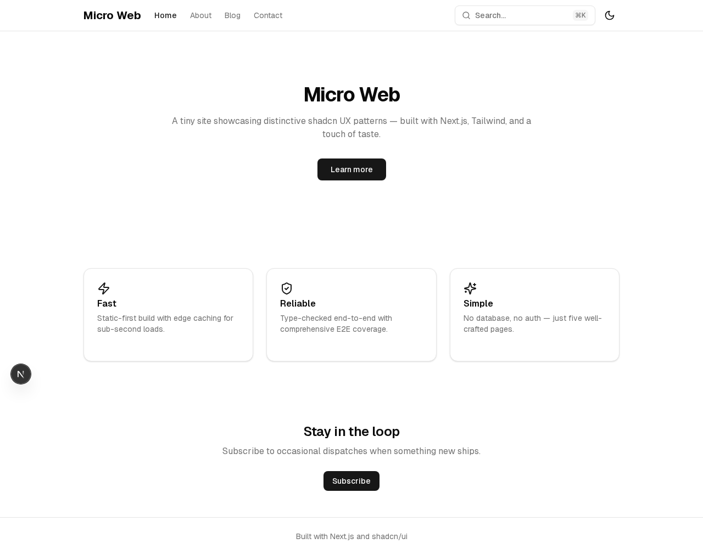

[< Back to Index](../INDEX.md)

# MiniShop Walkthrough

A complete end-to-end orchestration example using the MiniShop e-commerce scaffold. This walkthrough shows exactly what happens from start to finish.

## What MiniShop Is

MiniShop is a synthetic e-commerce application (Next.js + Prisma + Playwright) used to validate set-core's orchestration pipeline. It exercises the full stack: storefront, product catalog, cart, checkout, admin dashboard, authentication, and order management.

## Prerequisites

- set-core installed (`./install.sh` completed)
- `set-orch-core serve` running on port 7400
- Claude Code available in PATH

## Step-by-Step Timeline

### 1. Scaffold and Initialize

```bash
./tests/e2e/run.sh minishop
```

This single command does everything:

```
[run.sh] Creating project directory: minishop-run11
[run.sh] Running: set-project init --name minishop-run11 --project-type web --template nextjs
  ✓ Deployed .claude/ directory (rules, skills, commands)
  ✓ Created orchestration.yaml
  ✓ Created project-type.yaml (web)
[run.sh] Registering project with orchestration engine...
  ✓ Registered at http://localhost:7400/api/projects
[run.sh] Starting sentinel supervisor...
  ✓ Sentinel PID: 48291
```

The project is created under `~/.local/share/set-core/e2e-runs/minishop-run11/`.

### 2. Digest Phase

The sentinel reads the MiniShop spec and extracts structured requirements:

```
[sentinel] Digesting spec: docs/minishop-spec.md
[sentinel] Extracted 24 requirements across 6 domains:
  - Auth (4 requirements): login, register, session, admin-only
  - Products (5 requirements): listing, detail, search, categories, images
  - Cart (4 requirements): add, remove, update quantity, persistence
  - Checkout (3 requirements): order creation, confirmation, validation
  - Admin (5 requirements): dashboard, product CRUD, order management
  - Layout (3 requirements): navigation, responsive, error pages
```

### 3. Decompose Phase

The engine breaks requirements into a dependency DAG of changes:

```
[orchestrator] Decomposed into 6 changes:
  Phase 1 (parallel):
    ├── setup-prisma-schema   (S)  deps: []
    └── auth-system           (M)  deps: []
  Phase 2 (parallel):
    ├── product-catalog       (M)  deps: [setup-prisma-schema]
    └── admin-dashboard       (L)  deps: [setup-prisma-schema, auth-system]
  Phase 3:
    └── cart-and-checkout     (L)  deps: [product-catalog, auth-system]
  Phase 4:
    └── layout-and-polish     (S)  deps: [cart-and-checkout, admin-dashboard]
```

### 4. Dispatch Phase

Each change gets its own git worktree and Claude Code agent:

```
[dispatcher] Creating worktree: wt-setup-prisma-schema (from main)
[dispatcher] Creating worktree: wt-auth-system (from main)
[dispatcher] Starting Ralph Loop for setup-prisma-schema (budget: 500K tokens)
[dispatcher] Starting Ralph Loop for auth-system (budget: 2M tokens)
```

At this point the manager shows the project with active worktrees:


### 5. Monitor Phase

The dashboard provides real-time visibility. Open `http://localhost:7400` and select the project.

**Dashboard overview** -- shows orchestration status, phase progress, and agent activity:


**Changes tab** -- gate badges (green check, red X, yellow warning) give immediate pass/fail visibility:


**Phases tab** -- dependency tree with phase-level progress and timing:


The sentinel polls every 15 seconds:

```
[monitor] setup-prisma-schema: iteration 3/10, 124K tokens used
[monitor] auth-system: iteration 5/10, 891K tokens used
[monitor] setup-prisma-schema: status changed to "done"
[monitor] Moving setup-prisma-schema to verification
```

### 6. Verification Phase

Each completed change passes through quality gates:

```
[verifier] setup-prisma-schema: running gate sequence
  ✓ test     (vitest run --passWithNoTests)     8.2s
  ✓ build    (tsc --noEmit && next build)       22.1s
  ✓ review   (LLM code review)                  15.4s
  ✓ spec_coverage (3/3 requirements covered)     2.1s
[verifier] setup-prisma-schema: ALL GATES PASSED
```

If a gate fails, the agent gets the error output and retries (up to 2 retries by default):

```
[verifier] auth-system: gate "test" FAILED (attempt 1/3)
  Error: FAIL src/app/api/auth/login/route.test.ts
         Expected 401, received 500
[verifier] Returning to agent for fix...
[verifier] auth-system: gate "test" PASSED (attempt 2/3)
```

### 7. Merge Phase

Verified changes enter a sequential merge queue:

```
[merger] Merging setup-prisma-schema into main (ff-only)
  ✓ Fast-forward merge successful
  ✓ Post-merge: pnpm install (12.3s)
  ✓ Post-merge: next build (18.7s)
  ✓ Post-merge: smoke test (6.1s)
[merger] setup-prisma-schema merged successfully
[merger] Dispatching product-catalog (dependency satisfied)
[merger] Dispatching admin-dashboard (dependencies satisfied)
```

### 8. Replan Phase

After all planned changes merge, the engine checks spec coverage:

```
[replan] Spec coverage: 22/24 requirements (91.7%)
[replan] Uncovered: responsive-layout, error-pages
[replan] Generating replan phase...
[replan] Phase 5: 1 new change (layout-responsive-errors, S)
```

### 9. Token Tracking

The tokens tab tracks consumption across all agents:


Typical MiniShop token usage:

```
Change                  Input      Output     Cost
setup-prisma-schema     312K       89K        $0.42
auth-system             1.4M       412K       $2.18
product-catalog         987K       298K       $1.51
admin-dashboard         2.1M       634K       $3.89
cart-and-checkout        1.8M       521K       $3.12
layout-and-polish       245K       78K        $0.31
─────────────────────────────────────────────────
Total                   6.8M       2.0M       $11.43
```

### 10. Final Result

The completed app screenshots show what was built:




## Benchmark Results

Typical MiniShop runs:

| Metric | Value |
|--------|-------|
| Changes merged | 6/6 |
| Human interventions | 0 |
| Wall time | ~1h 45m (2 parallel agents) |
| Total tokens | 6--9M |
| Gate failures caught | Duplicate routes, missing auth, broken builds |

See [benchmarks](../learn/benchmarks.md) for detailed run metrics across multiple scaffolds.

## What Can Go Wrong

| Issue | How the system handles it |
|-------|--------------------------|
| Agent crashes mid-implementation | Sentinel detects dead PID, restarts agent with state recovery |
| Test gate fails | Agent receives error output, retries up to 2 times |
| Merge conflict | LLM-based conflict resolver attempts auto-resolution |
| Token budget exceeded | Watchdog warns at 80%, pauses at 100%, fails at 120% |
| Spec coverage gap | Auto-replan generates additional changes |

## Running It Yourself

```bash
# Full auto: scaffold + init + register + start
./tests/e2e/run.sh minishop

# Or register-only, then start from the manager UI
./tests/e2e/run.sh minishop --no-start
```

See the [first project guide](first-project.md) for setting up your own project instead of the MiniShop scaffold.

---

[< Back to Index](../INDEX.md)

<!-- specs: orchestration-engine, e2e-benchmark, minishop-scaffold, sentinel-dashboard -->
