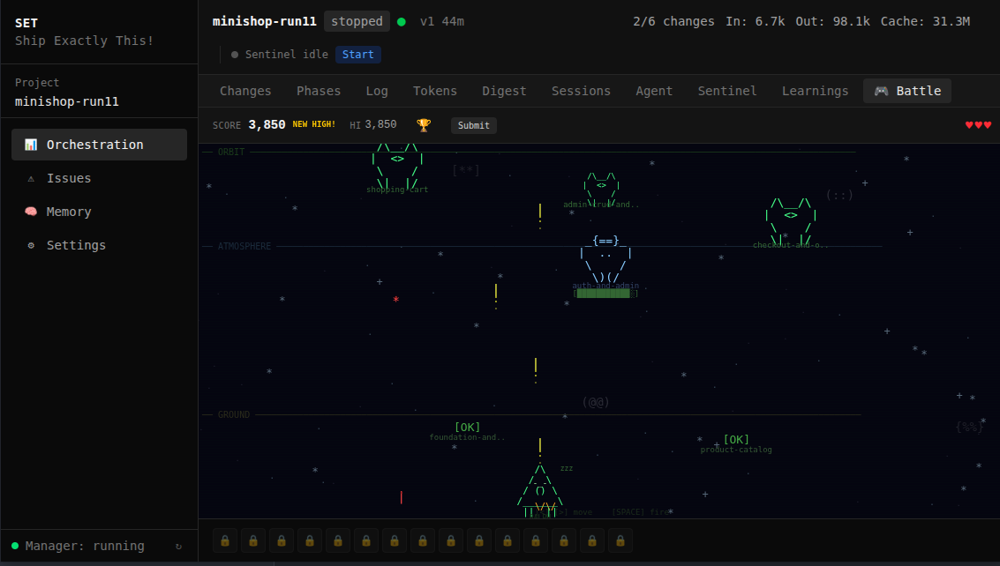

[< Back to Guides](README.md)

# Web Dashboard

set-core includes a browser-based dashboard for real-time monitoring of orchestration runs, agent activity, and project management.

## Setup

```bash
# Start the dashboard server
set-orch-core serve --port 7400

# Or install as a systemd service (auto-start on boot)
set-web-install
```

Open http://localhost:7400 in your browser.

For remote access via Tailscale HTTPS: `set-web-install --tailscale`

## Project Manager

The landing page shows all registered projects with status, progress, and token usage.


Click a project to open its orchestration dashboard.

## Orchestration Dashboard

### Changes Tab

Shows all changes with status, session count, duration, token usage, and quality gate badges (B=build, T=test, S=smoke, R=review, V=spec verify).


### Phases Tab

Groups changes by execution phase. Dependencies shown with `└` connectors, completed phases with check icons.


### Tokens Tab

Token usage per change — input, output, and cache breakdown.


### Sessions Tab

Agent session history with commands, worktrees, and iteration progress.


### Log Tab

Real-time orchestration log — engine events, gate results, merge operations.


### Agent Chat Tab

Interactive chat interface for communicating with the orchestration agent.


### Learnings Tab

Agent reflections, review findings, and gate performance statistics.


### Sentinel Tab

Real-time sentinel supervisor events -- crash detection, checkpoint approvals, stall investigations, and restart decisions.


### Digest Tab

Structured requirements extracted from the spec, with coverage status showing which requirements have been addressed by merged changes.


### Battle View

A compact, information-dense view for monitoring high-parallelism runs. Shows all active changes side-by-side with live status updates.



## Secondary Pages

### Memory

Memory system health, breakdown by type, and retrieval statistics.


### Settings

Project paths, runtime status, process tree, and orchestration controls.


### Issues

Issue tracking with severity badges, investigation status, and timeline.


### Worktrees

Active worktrees with agent logs, iteration count, and reflection badges.


### Global Issues

Cross-project issue browser accessible from the top navigation.


## Configuration

| Variable | Default | Description |
|----------|---------|-------------|
| `WT_WEB_PORT` | `7400` | Dashboard port |
| `WT_TAILSCALE_HOSTNAME` | auto | Tailscale hostname override |
| `SONIOX_API_KEY` | — | Voice input (optional) |

## Regenerating Screenshots

All dashboard screenshots are auto-generated:

```bash
make screenshots-web    # dashboard screenshots
make screenshots        # all screenshots (web + CLI + app)
```

See [Screenshot Pipeline](../reference/screenshot-pipeline.md) for details.

## Keyboard Shortcuts

The dashboard supports keyboard navigation for power users:

| Key | Action |
|-----|--------|
| `1`-`9` | Switch between tabs |
| `r` | Refresh data |
| `?` | Show help overlay |

---

*Next: [Sentinel](sentinel.md) | [Orchestration](orchestration.md) | [CLI Reference](../reference/cli.md)*

<!-- specs: web-dashboard-spa, sentinel-dashboard, web-api-server, web-service-lifecycle -->
