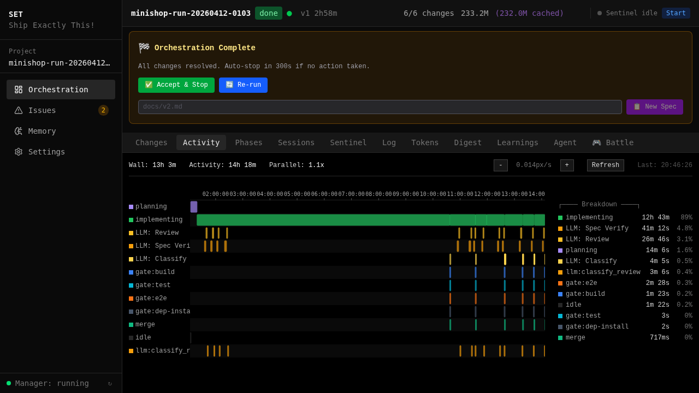
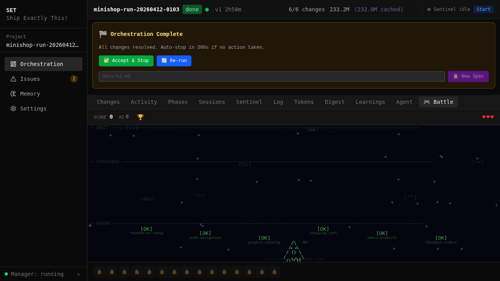
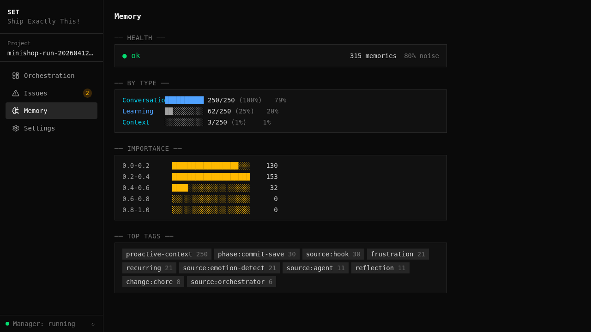
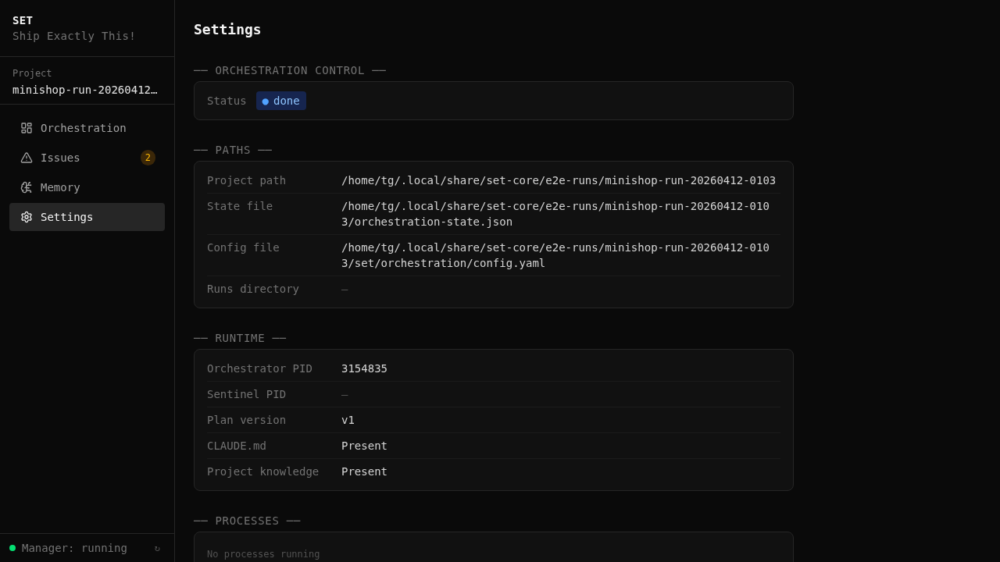

[< Back to Guides](README.md)

# Web Dashboard

set-core includes a browser-based dashboard for real-time monitoring of orchestration runs, agent activity, and project management.

## Setup

```bash
# Start the dashboard server
set-orch-core serve --port 7400

# Or install as a systemd service (auto-start on boot)
set-web-install
```

Open http://localhost:7400 in your browser.

For remote access via Tailscale HTTPS: `set-web-install --tailscale`

## Project Manager

The landing page shows all registered projects with status, progress, and token usage.


Click a project to open its orchestration dashboard.

## Orchestration Dashboard

### Changes Tab

The Changes tab is split in two. On the left, a list of all changes with status, session count, duration, token usage, and quality gate badges (B=build, T=test, S=smoke, R=review, V=spec verify). On the right, the **Change State DAG** — a React Flow graph that visualises every attempt the selected change went through.


#### Change State DAG

Each row in the graph is one attempt at the change. Nodes progress left-to-right through the pipeline:

- **Impl node** (violet, ✎ icon) — the agent's code-generation window; shows attempt number and duration.
- **Gate nodes** — one per gate (build, test, e2e, review, smoke, scope_check, rules, e2e_coverage, merge). Border colour reflects the result (green pass, red fail, amber warn, blue running). Shows the result icon, gate name, duration, timestamp, and a ⟳N badge if the gate ran multiple times.
- **Terminal node** — final state of the attempt, bold ✓ merged (green) or ✗ failed (red), with total duration.
- **Retry edges** — curved lines labelled *retry* (gate failure) or *conflict* (merge conflict) loop from the last gate of a failed attempt back to the impl of the next attempt.

The graph is built live from the change journal, so running gates appear as they start. The **toolbar** above the canvas shows attempt count, total duration, gate-run count, and two controls:

- **Auto Follow** — re-fits the viewport when new nodes arrive so the live frontier stays on screen. Disable it to pan and zoom manually.
- **DAG / Log** — toggles between the graph and the older linear Log view (kept for detail-heavy inspection; same underlying data).

Click any node to open a detail panel below the canvas with verdict source, classifier downgrades, gate output, or session logs for impl nodes. Press Escape or click the close button to dismiss it.

### Phases Tab

Groups changes by execution phase. Dependencies shown with `└` connectors, completed phases with check icons.


### Tokens Tab

Token usage per change — input, output, and cache breakdown.


### Activity Tab

Gantt-style timeline of every agent session: planning, implementing, gate runs, merge, and idle gaps. Click any span to open a drilldown with per-tool time, LLM-wait time, sub-agent attribution, and overhead.



### Sessions Tab

Agent session history with commands, worktrees, and iteration progress.

### Log Tab

Real-time orchestration log — engine events, gate results, merge operations.


### Agent Chat Tab

Interactive chat interface for communicating with the orchestration agent.


### Learnings Tab

Agent reflections, review findings, and gate performance statistics.


### Sentinel Tab

Real-time sentinel supervisor events -- crash detection, checkpoint approvals, stall investigations, and restart decisions.


### Digest Tab

Structured requirements extracted from the spec, with coverage status showing which requirements have been addressed by merged changes.


### Battle View

A compact, information-dense view for monitoring high-parallelism runs. Shows all active changes side-by-side with live status updates.



## Secondary Pages

### Memory

Memory system health, breakdown by type, and retrieval statistics.



### Settings

Project paths, runtime status, process tree, and orchestration controls.



### Issues

Issue tracking with severity badges, investigation status, and timeline.


### Worktrees

Active worktrees with agent logs, iteration count, and reflection badges.


### Global Issues

Cross-project issue browser accessible from the top navigation.


## Configuration

| Variable | Default | Description |
|----------|---------|-------------|
| `WT_WEB_PORT` | `7400` | Dashboard port |
| `WT_TAILSCALE_HOSTNAME` | auto | Tailscale hostname override |
| `SONIOX_API_KEY` | — | Voice input (optional) |

## Regenerating Screenshots

All dashboard screenshots are auto-generated:

```bash
make screenshots-web    # dashboard screenshots
make screenshots        # all screenshots (web + CLI + app)
```

See [Screenshot Pipeline](../reference/screenshot-pipeline.md) for details.

## Keyboard Shortcuts

The dashboard supports keyboard navigation for power users:

| Key | Action |
|-----|--------|
| `1`-`9` | Switch between tabs |
| `r` | Refresh data |
| `?` | Show help overlay |

---

*Next: [Sentinel](sentinel.md) | [Orchestration](orchestration.md) | [CLI Reference](../reference/cli.md)*

<!-- specs: web-dashboard-spa, sentinel-dashboard, web-api-server, web-service-lifecycle -->
