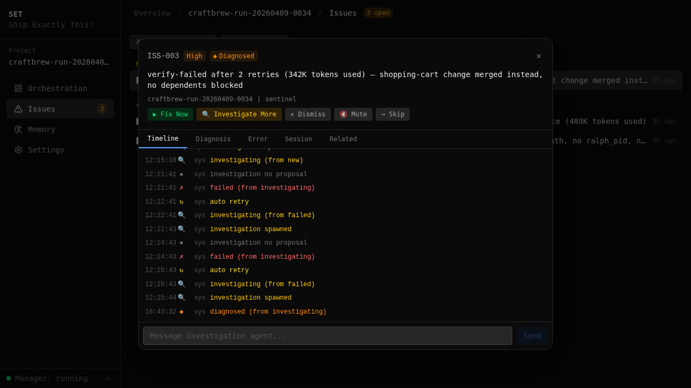
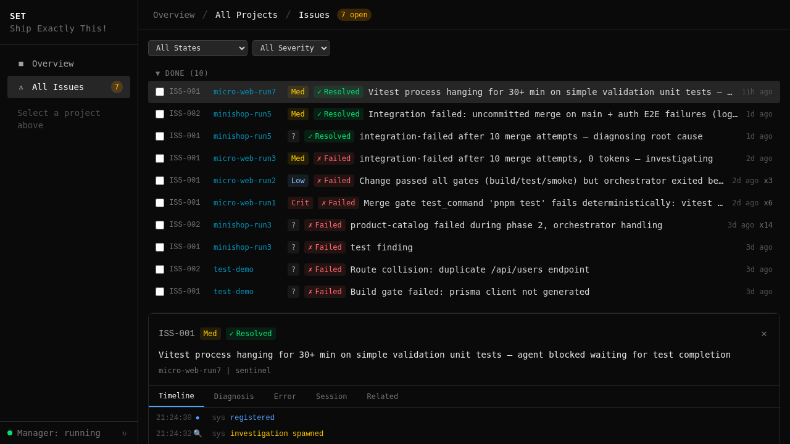

[< Back to Guides](README.md)

# Issue Pipeline — Self-Healing Orchestration

The issue pipeline automatically detects, investigates, and fixes problems during orchestration runs. When a quality gate fails or the sentinel finds a bug, it doesn't just report it — it diagnoses the root cause and applies a fix.

## How It Works

```
gate failure / sentinel finding
        │
        ▼
   ┌─────────┐     ┌──────────────┐     ┌─────────┐     ┌────────┐
   │ DETECT  │────▶│ INVESTIGATE  │────▶│  FIX    │────▶│ VERIFY │
   │         │     │              │     │         │     │        │
   │ registry│     │ /opsx:ff     │     │ apply + │     │ re-run │
   │ creates │     │ diagnoses    │     │ deploy  │     │ gates  │
   │ ISS-001 │     │ root cause   │     │ to wt   │     │        │
   └─────────┘     └──────────────┘     └─────────┘     └────────┘
```

1. **Detect** — the detector bridge scans sentinel findings, gate failures, and watchdog escalations. Each becomes a structured issue with severity, context, and source.

2. **Investigate** — a fresh agent session analyzes the issue. It reads the error, examines the code, and produces a structured diagnosis with root cause, confidence level, and recommended fix scope.

3. **Fix** — if the policy engine approves (based on severity × confidence × mode), a fix agent applies the change using the standard OpenSpec workflow. The fix gets its own worktree (`fix-iss-001`).

4. **Verify** — the fix goes through the same quality gates as any other change before merging.

## What Gets Detected

| Source | Example | Severity |
|--------|---------|----------|
| **Integration gate failure** | Build fails after merge to main | critical |
| **E2E test failure** | Playwright test breaks on a page | high |
| **Sentinel finding** | Agent stuck in retry loop | medium |
| **Watchdog escalation** | Agent unresponsive for 120s | high |
| **Review finding** | Security issue found in code review | varies |

## The Policy Engine

Not every issue gets auto-fixed. The policy engine decides based on:

| Factor | Impact |
|--------|--------|
| **Severity** | critical → auto-investigate immediately; low → queue |
| **Confidence** | High confidence diagnosis → auto-fix; low → wait for human |
| **Mode** | Auto mode → full pipeline; manual mode → investigate only |
| **History** | Repeated issue → escalate; first occurrence → standard flow |

## Dashboard

The web dashboard shows all issues across projects:

### Project Issues

Issue list with severity badges, state indicators, and investigation status.



### Global Issues

Cross-project issue browser — see all open issues across all orchestration runs.



## Issue States

```
new → investigating → diagnosed → fixing → fix_verified → resolved
                   ↘ dismissed (false positive)
                   ↘ escalated (needs human)
```

## CLI & API

Issues are accessible via the web dashboard API:

| Endpoint | Purpose |
|----------|---------|
| `GET /api/{project}/issues` | List issues (filterable by state, severity) |
| `POST /api/{project}/issues/{id}/investigate` | Trigger investigation |
| `POST /api/{project}/issues/{id}/fix` | Trigger fix |
| `POST /api/{project}/issues/{id}/dismiss` | Dismiss as false positive |
| `GET /api/{project}/issues/stats` | Issue statistics |
| `GET /api/{project}/issues/audit` | Audit trail |

## The Fix Worktree Pattern

When the pipeline fixes an issue, it creates a dedicated worktree:

```
fix-iss-001/
├── .openspec change created via /opsx:ff
├── proposal.md (diagnosis → fix plan)
├── design.md (technical approach)
├── tasks.md (implementation steps)
└── code changes applied and verified
```

The fix follows the same OpenSpec workflow as any feature — proposal, design, tasks, implementation. This ensures fixes are structured, not ad-hoc patches.

## Engine Modules

| Module | Purpose |
|--------|---------|
| `detector.py` | Scans sources, creates issues |
| `investigator.py` | Spawns diagnosis agent |
| `fixer.py` | Applies fixes via OpenSpec |
| `deployer.py` | Deploys fixes to affected worktrees |
| `policy.py` | Decides auto-fix vs escalate |
| `registry.py` | Issue storage and state management |
| `models.py` | Issue data model and state machine |
| `manager.py` | Orchestrates the full pipeline |
| `audit.py` | Audit trail and history |

## Key Insight

> The issue pipeline investigates before it acts. It doesn't guess — it reads the error, examines the code, produces a diagnosis with confidence level, and only then decides whether to fix automatically or escalate. This is the difference between "self-healing" and "self-breaking."

---

*Next: [Sentinel](sentinel.md) · [Orchestration](orchestration.md) · [Dashboard](dashboard.md)*

<!-- specs: issue-registry, issue-state-machine, issue-policy-engine, investigation-runner, fix-runner -->
