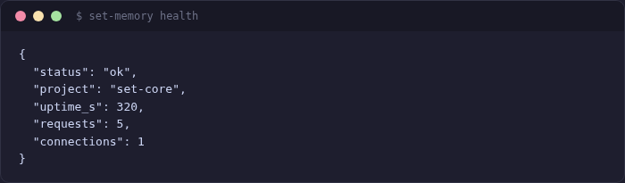
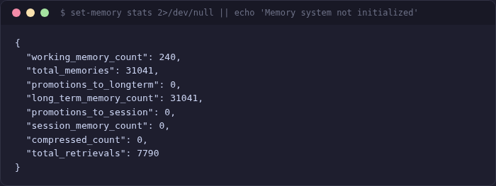

[< Back to Index](../INDEX.md)

# Persistent Memory

set-core includes a persistent memory system (shodh-memory) that gives agents cross-session recall — decisions, learnings, and context survive across conversations and are shared between agents.

## How It Works

Memory operates through **hooks** that fire automatically during Claude Code sessions:

| Hook | When | What |
|------|------|------|
| **Warmstart** | Session start | Loads relevant memories as context |
| **Pre-tool** | Before each tool call | Injects topic-based recall |
| **Post-tool** | After Read/Bash | Surfaces past experience for the file/command |
| **Save** | Session end | Extracts and saves new insights |

Agents don't need to explicitly save — the infrastructure handles it.

## CLI Commands

```bash
set-memory health          # check memory system status
set-memory stats           # memory statistics
set-memory recall "query"  # semantic search
set-memory list             # list all memories
set-memory forget <id>     # remove a memory
```





## Web Dashboard

The memory page shows health status, type breakdown, and retrieval statistics:


## MCP Tools

The memory system is also available as MCP tools for programmatic access:

| Tool | Purpose |
|------|---------|
| `remember` | Save a memory with type and tags |
| `recall` | Semantic search |
| `brain` | 3-tier memory visualization |
| `context_summary` | Condensed summary by category |
| `proactive_context` | Topic-aware context injection |
| `forget` | Remove a memory |
| `list_memories` | List with filters |
| `memory_stats` | Health and metrics |

## Installation

```bash
pip install 'shodh-memory>=0.1.81'
set-memory health   # verify
```

Memory degrades gracefully — if not installed, all memory commands silently no-op. Agents work fine without it, they just don't have cross-session recall.

## Key Insight

> Agents don't save memories voluntarily — across 15+ sessions in benchmarks, zero voluntary saves were observed. The hook-driven infrastructure is essential.

---

*Next: [Dashboard](dashboard.md) · [Team Sync](team-sync.md) · [Worktrees](worktrees.md)*

<!-- specs: developer-memory-docs, ambient-memory, hook-driven-memory, memory-cli, mcp-memory-tools -->
