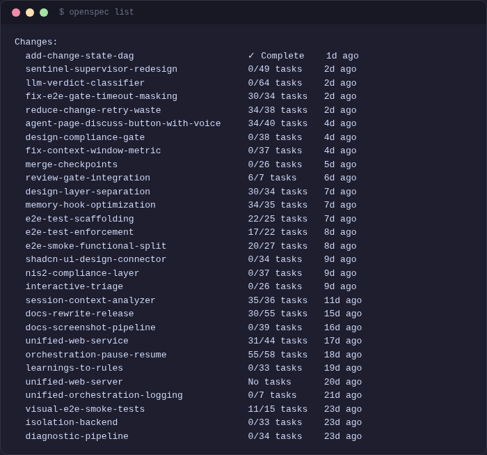
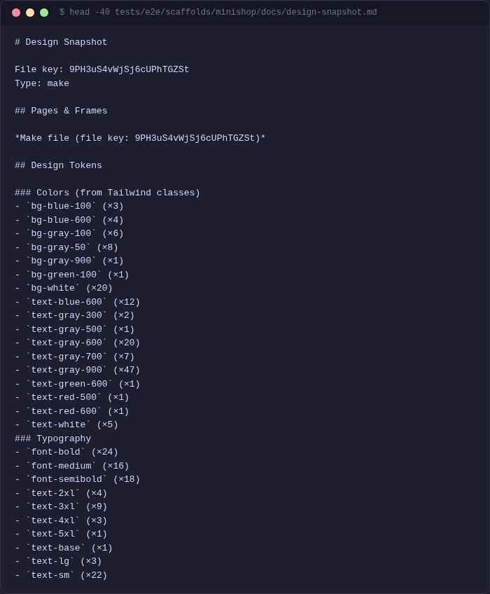

[< Back to Guides](README.md)

# OpenSpec — Structured Development Workflow

OpenSpec is the artifact-driven workflow system that keeps agents on track. Instead of giving an agent a vague prompt, you give it a structured pipeline: proposal → design → specs → tasks → implementation.

## Why OpenSpec

Without structure, agents drift. They skip requirements, make inconsistent decisions, and produce code that doesn't match the spec. OpenSpec solves this by breaking work into tracked artifacts with dependencies.

## The Workflow

```
/opsx:explore  →  /opsx:new  →  /opsx:apply  →  /opsx:verify  →  /opsx:archive
```

| Step | Command | What it does |
|------|---------|--------------|
| **Explore** | `/opsx:explore` | Think through the problem before committing |
| **New** | `/opsx:new <name>` | Create a change with artifact scaffolding |
| **Fast-Forward** | `/opsx:ff <name>` | Create all artifacts in one go |
| **Apply** | `/opsx:apply` | Implement tasks from the change |
| **Verify** | `/opsx:verify` | Check implementation matches specs |
| **Archive** | `/opsx:archive` | Finalize and sync specs |

## Artifacts

Each change produces these artifacts in sequence:

| Artifact | Purpose | Contains |
|----------|---------|----------|
| `proposal.md` | Why this change? | Problem, capabilities, impact |
| `specs/*/spec.md` | What should it do? | Requirements with WHEN/THEN scenarios |
| `design.md` | How to build it? | Technical decisions, trade-offs |
| `tasks.md` | What to implement? | Checkboxed task list linked to requirements |

## Quick Example

```bash
# Fast-forward: create all artifacts at once
/opsx:ff add-user-auth

# Implement the tasks
/opsx:apply

# Verify implementation matches specs
/opsx:verify

# Archive when done
/opsx:archive
```

## How Orchestration Uses OpenSpec

During autonomous orchestration, each dispatched agent uses OpenSpec internally:

1. The orchestrator decomposes the spec into changes
2. Each change gets a proposal with scope boundaries
3. The Ralph Loop agent creates remaining artifacts and implements tasks
4. The verify gate checks spec coverage before merge

This is why orchestrated code tends to be well-structured — the agents follow a consistent development methodology.

## OpenSpec CLI

```bash
openspec list                    # show active changes
openspec status --change <name>  # show artifact progress
openspec new change <name>       # create a new change
```



## Spec Preview

Use `openspec status` to see a visual preview of a change's artifact progress:


## Bulk Operations

When you have completed multiple changes, archive them in batch:

```
/opsx:bulk-archive
```

This archives all changes whose tasks are 100% complete and whose specs have been synced.

To sync spec changes to main without archiving (useful for mid-flight updates):

```
/opsx:sync
```

## Spec-Doc Cross-References

Each documentation page references the openspec specs it covers via HTML comments:

```html
<!-- specs: verify-gate, gate-profiles, orchestration-engine -->
```

When a spec changes, `grep -r "specs:.*verify-gate" docs/` finds all docs that need updating.

## Design Integration

When a design tool (Figma, Penpot) is connected via MCP, the orchestration pipeline integrates design specs automatically:

1. **Preflight** -- fetches `design-snapshot.md` with tokens, colors, typography
2. **Decompose** -- injects design tokens into each change's scope
3. **Dispatch** -- appends relevant design context to the agent's proposal
4. **Verify** -- checks design compliance (token mismatches reported as warnings)



---

*Next: [Orchestration](orchestration.md) | [Worktrees](worktrees.md) | [Quick Start](quick-start.md)*

<!-- specs: openspec-cli, spec-management, spec-coverage-report, task-traceability, design-pipeline -->
