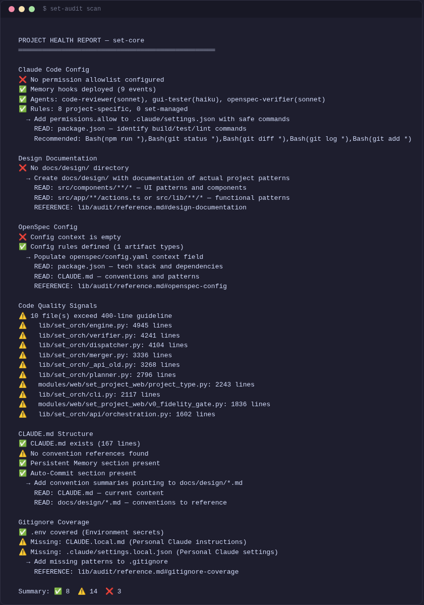

[< Back to Guides](README.md)

# Quick Start

This guide walks you from zero to your first autonomous orchestration run. By the end, you will have set-core installed, a project registered, and a sentinel running changes in parallel while you watch from the dashboard.

## Prerequisites

| Requirement | Check | Purpose |
|-------------|-------|---------|
| **Git** | `git --version` | Worktree management |
| **Python 3.10+** | `python3 --version` | Core engine and MCP server |
| **Node.js 18+** | `node --version` | Claude Code CLI |
| **jq** | `jq --version` | JSON processing in shell scripts |
| **OpenSpec CLI** | `openspec --version` | Spec-driven workflow |
| **Claude Code** | `claude --version` | AI agent runtime |

**Platform support:** Linux and macOS (Apple Silicon). Intel Macs are not tested.

Install OpenSpec if you do not have it yet:

```bash
npm i -g @fission-ai/openspec@1.1.1
```

## Install

```bash
git clone https://github.com/tatargabor/set-core.git
cd set-core
./install.sh
```

The installer symlinks all `set-*` CLI commands to `~/.local/bin`, configures the MCP server for Claude Code, installs Python dependencies, sets up shell completions, and **starts the web dashboard** as a systemd service.

After install, open http://localhost:7400 — you should see the manager page. If the dashboard doesn't start automatically, run:

```bash
set-orch-core serve --port 7400
```

## Try an E2E Test First

Before setting up your own project, see the full pipeline in action. Open a Claude Code session **from the set-core directory**:

```bash
cd set-core
claude
```

Then type:

```
run a micro-web E2E test
```

Claude will scaffold a simple 5-page website project, register it with the manager at http://localhost:7400, and start the sentinel. **The orchestration is started through the manager dashboard** — the sentinel uses the web UI to manage the run.

Watch the dashboard as the sentinel decomposes the spec, dispatches agents, runs quality gates, and merges results. A micro-web test typically completes in ~20 minutes.

For a more complex test, try:

```
run a minishop E2E test
```

This builds a full e-commerce app (products, cart, admin panel, auth) from a [detailed spec](../../tests/e2e/scaffolds/minishop/docs/v1-minishop.md) with [Figma design](../../tests/e2e/scaffolds/minishop/docs/design-snapshot.md). Expect ~1-2 hours.


## Set Up Your Own Project

Once you've seen how it works:

```bash
cd ~/my-project
set-project init --project-type web --template nextjs
```

This deploys hooks, commands, skills, and agents into your project's `.claude/` directory. The `--project-type` flag ensures the correct profile loads. Re-run anytime to update.

> **Tip:** Use `--dry-run` to preview changes before committing.

## Start an Orchestration

Open the dashboard at http://localhost:7400, select your project, enter your spec path in the input field, and click **Start**.


### Watch it work

The dashboard overview shows real-time progress -- active worktrees, agent status, gate results, and token usage:


Each change moves through planning, dispatch, implementation, verification, and merge. You can watch agents work in parallel across worktrees. The sentinel handles crashes, retries, and checkpoint approvals automatically.

### Step 6: See the result

Switch to the **Changes** tab to see every change the engine decomposed from your spec, along with its current status:


When all changes show **merged**, your spec has been fully implemented. The code is on your main branch, having passed through integration gates (dependency install, build, test, e2e) on every merge.

## What Just Happened

Here is the four-step pipeline that ran automatically:

1. **Decompose** -- The sentinel read your spec and broke it into discrete, ordered changes (e.g., "add header component", "build hero section", "add feature grid").
2. **Dispatch** -- Each change was assigned to a parallel worktree with its own Claude Code agent. Agents received a scoped proposal with exactly what to build.
3. **Implement & Verify** -- Each agent coded the change, then a verification gate reviewed the work (file size, secrets scan, build check, test run).
4. **Merge** -- Completed changes merged back to main through integration gates (dep install, build, test, e2e). The next change in the queue started immediately.

The sentinel supervised the entire process, restarting crashed agents, resolving conflicts, and producing a summary when done.

## Next Steps

Now that you have seen the full loop, explore these guides to go deeper:

- **[Orchestration](orchestration.md)** -- The full pipeline: digest, decompose, dispatch, verify, merge, replan
- **[Sentinel](sentinel.md)** -- Supervisor setup, crash recovery, and checkpoint handling
- **[Worktrees](worktrees.md)** -- Manual worktree commands (`set-new`, `set-work`, `set-merge`, `set-close`)
- **[OpenSpec](openspec.md)** -- Writing specs, the change lifecycle, and `/opsx:` skills
- **[Dashboard](dashboard.md)** -- Every tab of the web monitoring UI
- **[Memory](memory.md)** -- Cross-session agent recall with `set-memory`
- **[Configuration](../reference/configuration.md)** -- `orchestration.yaml`, profiles, and project-type plugins

---

*Having trouble? Run `set-audit scan` in your project to diagnose common setup issues.*



*Next: [Orchestration](orchestration.md) | [Sentinel](sentinel.md) | [Dashboard](dashboard.md)*

<!-- specs: orchestration-engine, dispatch-core, sentinel-dashboard -->
