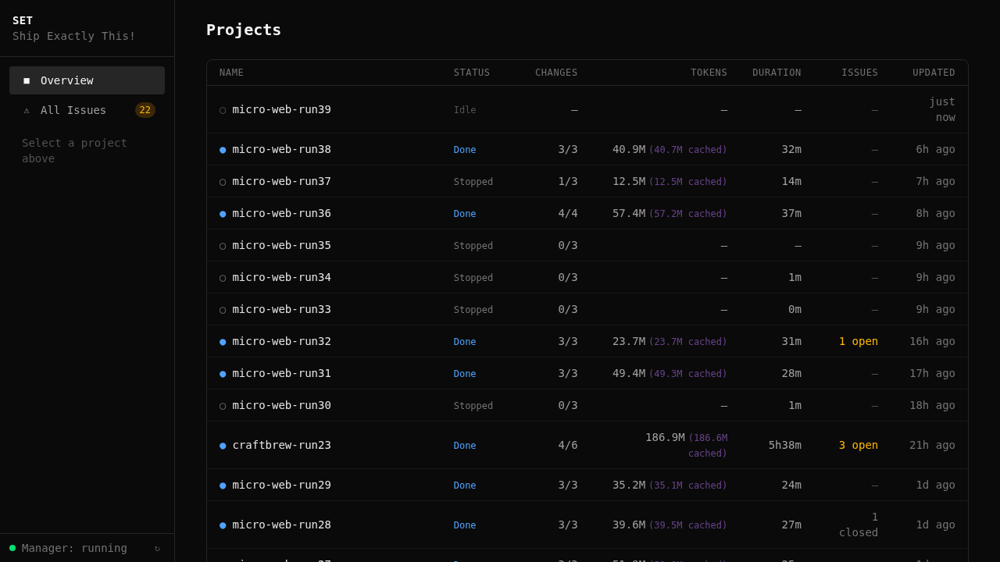

[< Back to README](../../README.md)

# Quick Start

This guide walks you from zero to your first autonomous orchestration run. By the end, you will have set-core installed, a project registered, and a sentinel running changes in parallel while you watch from the dashboard.

## Prerequisites

| Requirement | Check | Purpose |
|-------------|-------|---------|
| **Git** | `git --version` | Worktree management |
| **Python 3.10+** | `python3 --version` | Core engine and MCP server |
| **Node.js 18+** | `node --version` | Claude Code CLI |
| **jq** | `jq --version` | JSON processing in shell scripts |
| **OpenSpec CLI** | `openspec --version` | Spec-driven workflow |
| **Claude Code** | `claude --version` | AI agent runtime |

Install OpenSpec if you do not have it yet:

```bash
npm i -g @fission-ai/openspec@1.1.1
```

## Install

```bash
git clone https://github.com/tatargabor/set-core.git
cd set-core
./install.sh
```

The installer symlinks all `set-*` CLI commands to `~/.local/bin`, configures the MCP server for Claude Code, installs Python dependencies, and sets up shell completions. It will also ask about optional components like Developer Memory.

Verify the install:

```bash
set-list --help
```

## Register a Project

Point set-core at your existing project:

```bash
cd ~/my-project
set-project init --project-type web --template nextjs
```

This deploys hooks, commands, skills, and agents into your project's `.claude/` directory. The `--project-type` flag ensures the correct profile loads (web, example, or a custom plugin). Re-run anytime to update after upgrading set-core.

> **Tip:** Use `--dry-run` to preview what changes before committing.

## Your First Orchestration

This is the main event. You will write a short spec, start the orchestration engine, and let the sentinel decompose and execute it autonomously.

### Step 1: Write a spec

Create a spec file in your project. It does not need to be long -- three sentences is enough for the engine to decompose into concrete changes:

```bash
cat > docs/specs/landing-page.md << 'EOF'
# Landing Page

Build a responsive landing page with a hero section, feature grid (3 columns),
and a call-to-action button. Use the project's existing design system and colors.
Include a mobile-friendly hamburger menu in the header.
EOF
```

### Step 2: Start the dashboard

From the set-core directory, start the orchestration server:

```bash
set-orch-core serve
```

This launches the API server and web dashboard on port 7400.

### Step 3: Open the browser

Navigate to [http://localhost:7400](http://localhost:7400). You will see the manager view listing your registered projects:



### Step 4: Start the sentinel

Click your project in the list, then use the **Start Sentinel** button to launch an orchestration run. The dashboard lets you pick the spec file and set parallelism (start with 2 for your first run).

Behind the scenes, this is equivalent to running:

```bash
/set:sentinel --spec docs/specs/landing-page.md --max-parallel 2
```

### Step 5: Watch it work

The dashboard overview shows real-time progress -- active worktrees, agent status, gate results, and token usage:


Each change moves through planning, dispatch, implementation, verification, and merge. You can watch agents work in parallel across worktrees. The sentinel handles crashes, retries, and checkpoint approvals automatically.

### Step 6: See the result

Switch to the **Changes** tab to see every change the engine decomposed from your spec, along with its current status:


When all changes show **merged**, your spec has been fully implemented. The code is on your main branch, having passed through integration gates (dependency install, build, test, e2e) on every merge.

## What Just Happened

Here is the four-step pipeline that ran automatically:

1. **Decompose** -- The sentinel read your spec and broke it into discrete, ordered changes (e.g., "add header component", "build hero section", "add feature grid").
2. **Dispatch** -- Each change was assigned to a parallel worktree with its own Claude Code agent. Agents received a scoped proposal with exactly what to build.
3. **Implement & Verify** -- Each agent coded the change, then a verification gate reviewed the work (file size, secrets scan, build check, test run).
4. **Merge** -- Completed changes merged back to main through integration gates (dep install, build, test, e2e). The next change in the queue started immediately.

The sentinel supervised the entire process, restarting crashed agents, resolving conflicts, and producing a summary when done.

## Next Steps

Now that you have seen the full loop, explore these guides to go deeper:

- **[Orchestration & Sentinel](../sentinel.md)** -- Configuration, parallelism, conflict resolution, and monitoring
- **[Worktree Management](../cli-reference.md)** -- Manual worktree commands (`set-new`, `set-work`, `set-merge`, `set-close`)
- **[OpenSpec Workflow](../openspec.md)** -- Writing specs, the change lifecycle, and `/opsx:` skills
- **[Configuration](../configuration.md)** -- `orchestration.yaml`, profiles, and project-type plugins
- **[Developer Memory](../developer-memory.md)** -- Cross-session agent recall with `set-memory`

---

*Having trouble? Run `set-audit scan` in your project to diagnose common setup issues.*

<!-- specs: orchestration-engine, dispatch-core, sentinel-dashboard -->
