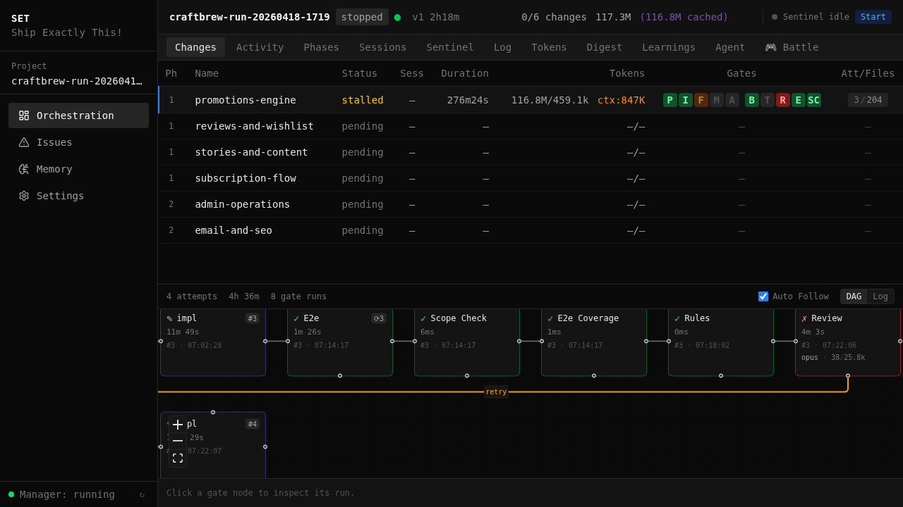
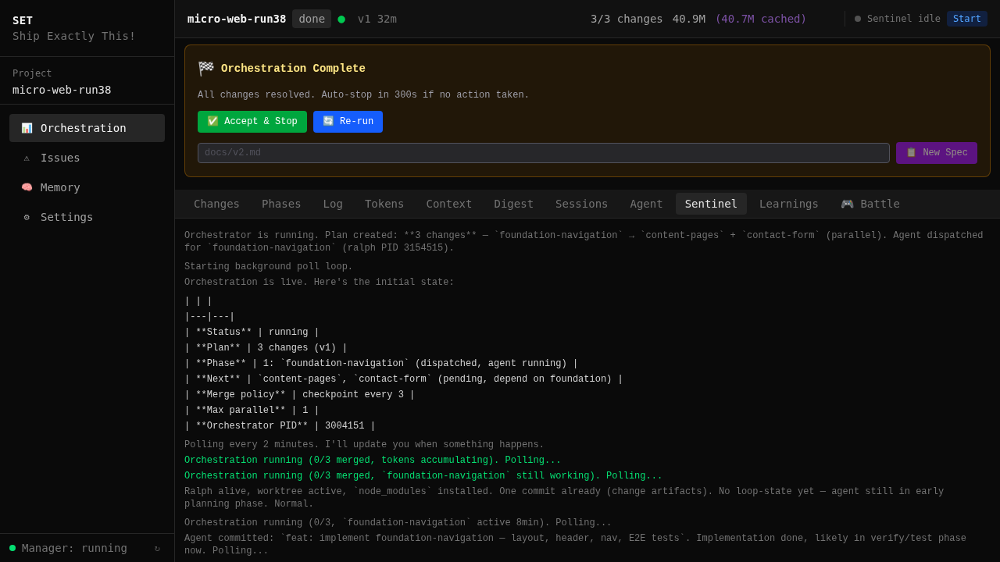
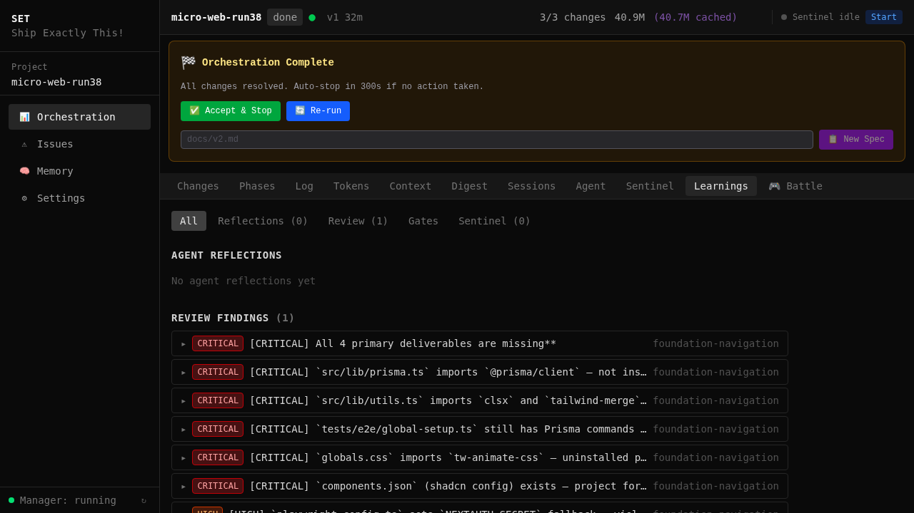
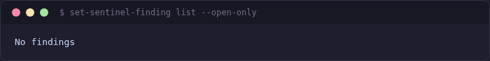

[< Back to Guides](README.md)

# Sentinel — Orchestration Supervisor

The sentinel is the process that supervises your orchestration run: it starts the orchestrator, restarts it on crashes, watches for stalls and anomalies, and keeps the dashboard fed with status events.

As of 2026-04-11, the default supervisor is a **Python daemon** (`set-supervisor`) that replaced the old Claude-driven sentinel skill. The daemon itself is cheap — it polls the PID and state files every 15s with zero LLM cost. Claude is only invoked when an anomaly detector fires or the periodic canary runs.

## Why Use It

Without a supervisor, a crash in the orchestrator process means your run stops and you have to notice and restart it manually. The sentinel:

- **Detects crashes** — catches non-zero exits and restarts the orchestrator (with a rapid-crash brake: 3 crashes in 5 minutes halts the run).
- **Detects stalls and anomalies** — state stalls, token stalls, log silence, integration failures, error-rate spikes, unknown event types. Each fires an **ephemeral Claude** subprocess with a focused prompt.
- **Runs a periodic canary** — every 15 minutes a fresh `claude -p` reads the orchestration snapshot and returns a verdict (`ok` / `note` / `warn` / `stop`).
- **Handles inbox messages** — reads user messages from `.set/sentinel/inbox/` (stop/status requests).
- **Feeds the dashboard** — events land in `.set/supervisor/events.jsonl` and stream to the Sentinel tab.

**Cost is minimal.** Phase 1 (daemon poll) is LLM-free. Phase 2 ephemeral triggers only fire on anomalies, and the canary runs once every 15 minutes — typical runs stay under a dozen subprocess calls.

## Spec Quality Prerequisites

Spec quality still determines output quality — the supervisor can recover from bugs but not from vague requirements. Before starting:

1. **Be specific** — "Add a product catalog with filter sidebar, 3-column grid, and sorting dropdown" not "Add products page".
2. **Include design tokens** — If you have a Figma design, run `set-design-sync` first (see [Design Integration](design-integration.md)). Without explicit colors/fonts/spacing, agents use generic shadcn defaults.
3. **Define data models** — Name your entities, fields, and relationships. "User has Orders, Order has OrderItems with Product reference" gives agents a concrete schema to implement.
4. **Specify i18n** — If your app is multilingual, state it. Without this, agents hardcode English strings.

## Starting the Sentinel

### From the Web Dashboard (recommended)

Open `http://localhost:7400`, select your project, and click **Start**. This POSTs to `/api/<project>/sentinel/start` with the spec path — the manager spawns `set-supervisor --project <path> --spec <path>` based on the project's `supervisor_mode` directive.



### From the CLI

```bash
# Manager API (preferred — matches what the dashboard Start button does)
curl -X POST http://localhost:7400/api/<project>/sentinel/start \
  -H 'Content-Type: application/json' \
  -d '{"spec":"docs/spec.md"}'

# Direct daemon spawn (skips the manager)
set-supervisor --project /path/to/project --spec docs/spec.md
```

### Without a Supervisor

Set `supervisor_mode: off` in the project's orchestration config to start `set-orchestrate start` directly. You lose crash recovery but avoid the daemon subprocess.

## Supervisor Modes

| Mode | What runs | When to use |
|------|-----------|-------------|
| `python` *(default)* | `set-supervisor` Python daemon — PID monitoring, anomaly detectors, ephemeral Claude triggers, canary | Production — the recommended path |
| `claude` | Legacy `/set:sentinel` skill — a long-running Claude Code session that polls and decides in-conversation | Fallback or comparison runs — kept for transition |
| `off` | `set-orchestrate start` directly, no supervisor wrapper | Short runs, debugging, CI |

Set the mode in your project's directives (or read it back via the dashboard Settings tab).

## How the Python Daemon Works

On each 15-second poll cycle the daemon:

1. **Checks orchestrator PID** — reaps zombies via `Popen.poll()`, then `os.kill(pid, 0)`.
2. **Handles crashes** — if PID is gone and state is non-terminal, restart; if terminal, stop. Rapid-crash brake halts after 3 crashes in 300 s.
3. **Reads the inbox** — processes stop/status messages from the user.
4. **Runs anomaly detectors** (Phase 2) — scans events/log/state for trigger conditions. For each fired trigger, spawns a fresh `claude -p` subprocess with a trigger-specific prompt.
5. **Runs the canary** (if 15 min elapsed) — spawns an ephemeral Claude to read a snapshot diff and return a CANARY_VERDICT.
6. **Persists status** — atomic write to `.set/supervisor/status.json` (PIDs, poll cycle, rapid crashes, event cursor, trigger attempts, canary timestamps).

### Anomaly Triggers (Phase 2)

| Trigger | Condition | Retry budget |
|---------|-----------|--------------|
| `process_crash` | Orchestrator exited non-zero | 3 |
| `state_stall` | `orchestration-state.json` mtime > 300 s | 2 |
| `log_silence` | Log file no new lines > 300 s | 2 |
| `token_stall` | Cumulative tokens < 500k over 30 min window | 2 |
| `integration_failed` | Merge integration phase reports `failed` | 2 |
| `error_rate_spike` | Error count in log > 3× rolling baseline | 2 |
| `unknown_event_type` | Unknown event code in events.jsonl | 2 |
| `terminal_state` | State flipped to `done` / `stopped` / `failed` | 1 |

Each trigger is deduplicated (same signature won't fire repeatedly), rate-limited (hourly spawn cap), and produces its own ephemeral Claude invocation with a stable-header + variable-body prompt so prompt caching keeps cost flat.

### Canary

Runs every 15 minutes regardless of activity (disable via config). Reads a CanaryDiff — the changes since the last canary — and emits `CANARY_VERDICT: ok | note | warn | stop`. `warn` escalates via a finding (rate-limited 30 min per signature). `stop` halts the orchestrator.

## Monitoring

The **Sentinel tab** in the dashboard streams daemon stdout (logs, trigger spawns, canary verdicts) in real time:



The **Learnings tab** shows findings (bugs, patterns, assessments) logged by the supervisor and agents:



## Helper Tools

All four legacy CLI helpers still exist and are called by ephemeral Claude subprocesses during anomaly triggers:

| Tool | Purpose |
|------|---------|
| `set-sentinel-finding` | Log bugs, patterns, and assessments (severity, message, change) |
| `set-sentinel-inbox` | Read user messages from `.set/sentinel/inbox/` |
| `set-sentinel-log` | Structured event logging |
| `set-sentinel-status` | Heartbeat for the dashboard status sync |

## Findings

During a run, agents and ephemeral trigger invocations log bugs, patterns, and observations as **findings**. These appear in the Learnings tab and are saved to `.set/sentinel/findings.json`.

```bash
set-sentinel-finding list
set-sentinel-finding add --type bug --summary "Agent loops on type error"
```



Findings feed into the **review learnings** system (see [Orchestration](orchestration.md)), so the same mistake doesn't get repeated in later changes or later runs.

## Configuration

| Directive / Env | Default | Effect |
|-----------------|---------|--------|
| `supervisor_mode` | `python` | `python` / `claude` / `off` (see table above) |
| `POLL_INTERVAL_SECONDS` | `15` | Daemon poll loop cadence (daemon.py) |
| `RAPID_CRASH_LIMIT` | `3 / 300 s` | Brake that halts the run after N crashes in window |
| `STATE_STALL_SECS` | `300` | State-stall threshold |
| `LOG_SILENCE_SECS` | `300` | Log-silence threshold |
| `TOKEN_STALL_LIMIT` | `500_000` | Minimum token delta over the window |
| `TOKEN_STALL_SECS` | `1800` | Token-stall window |
| `ERROR_BASELINE_MULTIPLIER` | `3×` | Error spike threshold |
| `DEFAULT_CANARY_INTERVAL_SECONDS` | `900` | 15-minute canary cadence |
| Ephemeral spawn | `sonnet`, `600 s`, `25 turns` | Model, timeout, max turns per trigger |

## Files

| File | Purpose |
|------|---------|
| `orchestration-state.json` | Orchestration state (read by daemon every poll) |
| `orchestration.log` | Orchestration log (crash diagnosis, anomaly detectors) |
| `orchestration-events.jsonl` | Live event stream (daemon + orchestrator) |
| `orchestration-events-cycle<N>.jsonl` | Sealed cycle from a previous replan or stop+start (rotated by `_rotate_event_streams`) |
| `orchestration-state-events-cycle<N>.jsonl` | State-events sibling for the same cycle |
| `state-archive.jsonl` | Append-only archive of completed/skipped/failed changes; each entry carries `spec_lineage_id`, `sentinel_session_id`, `plan_version`, `session_summary` |
| `orchestration-plan-<slug>.json` | Per-lineage plan retained when the operator switches `--spec` (sibling of the live `orchestration-plan.json`) |
| `set/orchestration/digest-<slug>/` | Per-lineage digest tree retained on lineage switch |
| `set/orchestration/spec-coverage-history.jsonl` | Append-only history of every merge's REQ coverage; powers Digest "merged by … (archived)" attribution |
| `set/orchestration/e2e-manifest-history.jsonl` | Append-only history of every merge's `e2e-manifest.json`; powers `/digest/e2e` aggregation across cycles |
| `set/orchestration/worktrees-history.json` | One JSON line per `.removed.<epoch>` worktree archival; rewrites `purged=true` after `set-close --purge` |
| `.set/supervisor/status.json` | Daemon status snapshot — PIDs, cursors, baselines, `spec_lineage_id` |
| `.set/supervisor/status-history.jsonl` | One archived status snapshot per clean stop, with `rotated_at` |
| `.set/supervisor/orch-logs/*.log` | Per-spawn orchestrator stdout/stderr |
| `.set/supervisor/claude-logs/*.log` | Per-trigger ephemeral Claude stdout/stderr |
| `.set/sentinel/stdout.log` | Daemon stdout (read by the Sentinel tab) |
| `.set/sentinel/findings.json` | Bugs and observations |
| `.set/sentinel/inbox/` | User messages to the supervisor |

### Lineage selector

The dashboard sidebar shows every spec lineage discovered for the project — derived from `state.spec_lineage_id`, `state-archive.jsonl` entries, and `.set/supervisor/status-history.jsonl`. Operators can switch to an inactive lineage to inspect its history without disturbing the live sentinel; data tabs (Activity, Tokens, Digest, Phases) accept a `?lineage=<id>` query parameter that defaults to the live lineage when the daemon is running, otherwise the lineage with the newest `last_seen_at`. `?lineage=__all__` returns the union; the synthetic `__legacy__` lineage covers untagged historic entries (legacy projects pre-migration).

## Tips

- **Use the dashboard to start and monitor.** The Start button goes through the manager API which resolves `supervisor_mode` and wires the daemon correctly. Starting with `nohup set-sentinel ...` from the shell skips the manager and leaves the dashboard blind.
- **Check findings between runs.** `set-sentinel-finding list` surfaces what the supervisor discovered. High-value findings belong in the spec or orchestration config.
- **Watch the Sentinel tab for trigger spawns.** When an ephemeral Claude subprocess runs, you'll see it land in the log — that's your signal that a stall or anomaly was detected.
- **Don't confuse `supervisor_mode=off` with stopping the sentinel.** `off` means "no supervision"; it does not stop an already-running daemon. Use the dashboard Stop button or send a stop inbox message.

---

*Next: [Orchestration](orchestration.md) | [Dashboard](dashboard.md) | [Quick Start](quick-start.md)*

<!-- specs: sentinel-supervisor, sentinel-dashboard, sentinel-polling, sentinel-findings, sentinel-events -->
