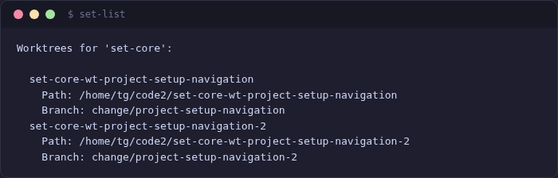
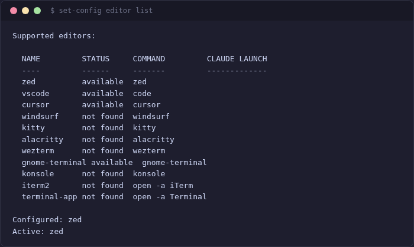
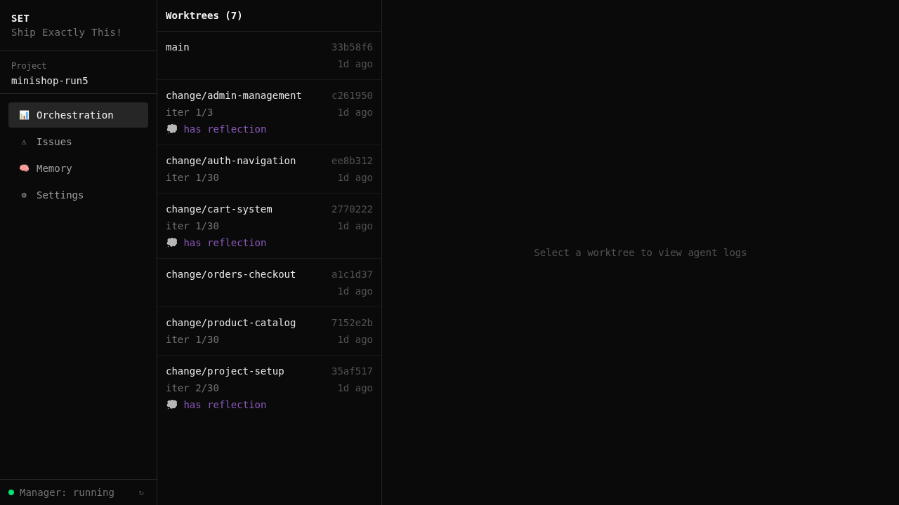
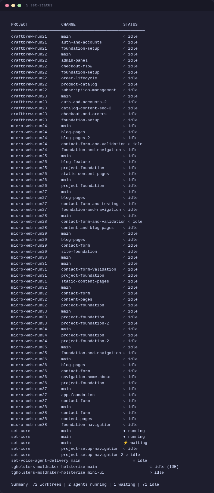

[< Back to Index](../INDEX.md)

# Worktree Management

set-core uses git worktrees for parallel development — each change gets its own isolated copy of the repo with its own Claude Code agent.

## Core Commands

```bash
set-new fix-login         # create worktree + branch
set-work fix-login        # open editor + start Claude Code
set-list                  # show all active worktrees
set-merge fix-login       # merge via integration gates
set-close fix-login       # remove worktree + branch
```



## Creating a Worktree

```bash
set-new <change-name>
```

This creates:
- A git worktree at `../<project>-<change-name>/`
- A branch `change/<change-name>` from current main
- Ready for an agent to start working

## Working in a Worktree

```bash
set-work <change-name>
```

Opens your configured editor (Zed, VS Code, Cursor) in the worktree directory and launches Claude Code. Configure your editor:

```bash
set-config editor list    # show available editors
set-config editor set zed # choose one
```



## Merging

```bash
set-merge <change-name>
```

Merging runs through **integration gates** before the actual merge:

1. **Dependency install** — `pnpm install` / `pip install`
2. **Build** — `pnpm build` / compile check
3. **Test** — `pnpm test` / `pytest`
4. **E2E** — Playwright tests (auto-detected)
5. **Fast-forward merge** — `git merge --ff-only` to main

If any gate fails, the merge is blocked with a clear error message.

## Ralph Loop (Autonomous Agent)

When the orchestrator dispatches a worktree, it starts a **Ralph Loop** — an autonomous Claude Code session that iterates until the task is done:

```bash
set-loop start <change-name>    # start autonomous loop
set-loop stop <change-name>     # stop the loop
set-loop status                 # show running loops
```

The loop:
- Runs Claude Code with the change's proposal/tasks as context
- Iterates up to 30 times (configurable)
- Auto-pauses on stall detection or budget limit
- Reports progress to `loop-state.json` (read by the orchestrator)

## Monitoring Worktrees

The web dashboard shows all active worktrees with agent logs and iteration progress:



From the CLI:

```bash
set-status    # show agent status for all worktrees
```



---

*Next: [Orchestration](orchestration.md) · [OpenSpec](openspec.md) · [Quick Start](quick-start.md)*

<!-- specs: worktree-tools, ralph-loop, dispatch-worktree, merge-strategy-integration -->
