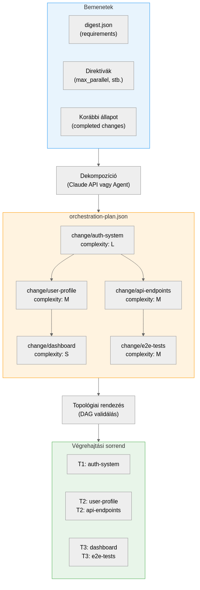

# Planning

## The Purpose of Decomposition

The planning phase breaks the specification (or digest) into **executable changes**. Each change is a self-contained, well-defined development task that an AI agent executes in a worktree.

{width=90%}

## Planning Methods

Two planning methods exist, controlled by the `plan_method` directive:

### API Mode (default)

A single Claude API call performs the decomposition:

```bash
set-orchestrate --spec docs/v3.md plan   # plan_method: api (default)
```

Advantages:

- Fast (1-2 minutes)
- Low token usage
- Deterministic output

### Agent Mode

A dedicated worktree runs a Ralph loop for planning, across multiple iterations:

```yaml
# orchestration.yaml
plan_method: agent
plan_token_budget: 500000
```

This method is useful when:

- The specification is very complex
- The planner needs to read code for good decomposition
- Test infrastructure discovery is needed

## The Plan Structure

The result of `cmd_plan()` is `orchestration-plan.json`:

```json
{
  "plan_version": 1,
  "brief_hash": "a1b2c3d4",
  "plan_phase": "phase-2",
  "plan_method": "api",
  "changes": [
    {
      "name": "auth-system",
      "scope": "Implement JWT authentication on /api/* endpoints",
      "complexity": "L",
      "change_type": "feature",
      "depends_on": [],
      "roadmap_item": "Auth system",
      "requirements": ["REQ-001", "REQ-004"],
      "also_affects_reqs": ["REQ-012"],
      "model": null,
      "skip_review": false,
      "skip_test": false
    },
    {
      "name": "user-profile",
      "scope": "Profile editing and avatar upload",
      "complexity": "M",
      "depends_on": ["auth-system"],
      "requirements": ["REQ-002", "REQ-003"]
    }
  ]
}
```

### Field Descriptions

| Field | Description |
|-------|------------|
| `name` | Unique identifier (becomes the branch name: `change/auth-system`) |
| `scope` | Detailed description for the agent |
| `complexity` | S (small), M (medium), L (large) — determines token limit |
| `change_type` | feature, fix, refactor, test, docs, config |
| `depends_on` | Dependencies (other change names) |
| `requirements` | Assigned REQ-XXX identifiers |
| `also_affects_reqs` | Cross-cutting requirements (awareness) |
| `model` | Change-specific model override (null = default) |
| `skip_review` | Skip review gate (e.g., for config changes) |
| `skip_test` | Skip test gate (e.g., for docs changes) |

## Topological Sort (DAG)

The `topological_sort()` function builds a directed acyclic graph (DAG) from the `depends_on` fields and returns changes in topological order.

**Rules**:

1. Changes without dependencies can start in parallel
2. A change can only start when all its dependencies are in `merged` status
3. Circular dependencies result in an error during plan generation

**Example**: If A ← B and A ← C, but D ← B,C:

```
T1: A (no dependencies)
T2: B, C (in parallel, after A merged)
T3: D (after B and C merged)
```

### Circular Dependency Detection

```bash
# The self-test includes a test:
set-orchestrate self-test
# → PASS: circular dependency detected
```

If the planner generates circular dependencies, the system throws an error and the plan must be rejected.

## Test Infrastructure Discovery

The `detect_test_infra()` function assesses the project's testing capabilities during the plan phase:

- **Framework**: vitest, jest, pytest, mocha
- **Config files**: vitest.config.ts, jest.config.js, etc.
- **Test files**: `*.test.*`, `*.spec.*`, `test_*.py`
- **Helper directories**: `src/test/`, `__tests__/`

This information is included in the planner prompt so that change scopes include testing.

## Spec Summarization for Large Documents

If the spec is too large (many thousand tokens), `summarize_spec()` uses a haiku model to summarize the material before the planner receives it:

1. The summarizer extracts the phase structure
2. Identifies completed and missing parts
3. The planner receives only the relevant phase

\begin{keypoint}
The plan is always viewable after generation: \texttt{set-orchestrate plan --show}. Before issuing the \texttt{start} command, it's worth checking that the decomposition is sensible.
\end{keypoint}

## Plan Validation

The generated plan is automatically validated:

- Every change name must be unique
- `depends_on` references must point to existing changes
- Circular dependencies are not allowed
- `complexity` values must be S, M, or L

If validation fails, the plan is not saved and the user receives an error message.
