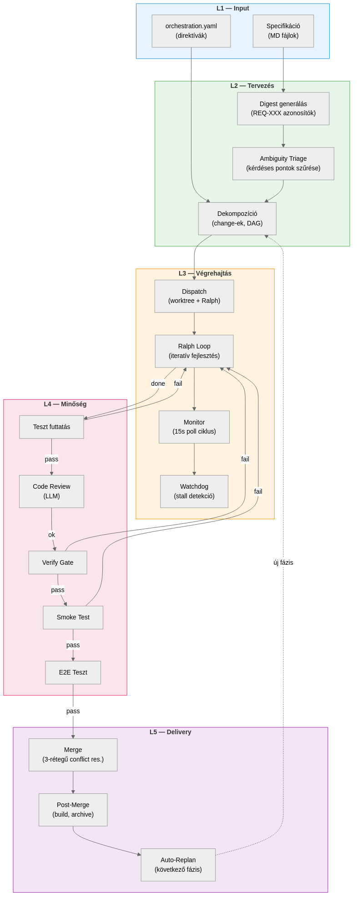

# Áttekintés

## Mi az orchestráció?

A `set-orchestrate` egy autonóm orchestrációs rendszer, amely egy szoftver-specifikációból kiindulva önállóan tervezi, végrehajtja és ellenőrzi a fejlesztési feladatokat. Az egész folyamat egyetlen paranccsal indul:

```bash
set-orchestrate --spec docs/v3.md plan
set-orchestrate start
```

A rendszer ezt követően:

1. **Megérti** a specifikációt (digest, requirement azonosítók)
2. **Megtervezi** a végrehajtást (change-ek, függőségi gráf)
3. **Párhuzamosan végrehajtja** a feladatokat (worktree-k, AI ágensek)
4. **Ellenőrzi** a minőséget (teszt, review, verify gate-ek)
5. **Összefésüli** az eredményt (merge, post-merge pipeline)
6. **Folytatja** a következő fázissal (auto-replan)

\begin{fontos}
Az orchestrátor nem egyetlen nagy LLM hívás. Ez egy állapotgépes rendszer, amely 15 másodpercenként ellenőrzi az ágensek állapotát, kezeli a hibákat, és autonóm döntéseket hoz a folytatásról.
\end{fontos}

## Az 5-réteg modell

Az orchestráció öt, egymásra épülő rétegből áll:

{width=95%}

| Réteg | Név | Felelősség | Főbb modulok |
|-------|-----|-----------|--------------|
| **L1** | Input | Specifikáció beolvasása, konfiguráció feloldása | `config.sh`, `utils.sh` |
| **L2** | Tervezés | Digest generálás, dekompozíció, DAG | `digest.sh`, `planner.sh` |
| **L3** | Végrehajtás | Worktree dispatch, Ralph loop, monitoring | `dispatcher.sh`, `monitor.sh`, `watchdog.sh` |
| **L4** | Minőség | Teszt, review, verify, smoke, E2E gate-ek | `verifier.sh` |
| **L5** | Delivery | Merge, post-merge, auto-replan | `merger.sh`, `monitor.sh` |

Az L1 és L2 rétegek a "gondolkodási" fázis: a rendszer megérti a feladatot és megtervezi a megközelítést. Az L3 a "munka" réteg, ahol az AI ágensek ténylegesen kódot írnak — itt töltődik a legtöbb idő és token. Az L4 a "minőség-ellenőrzés", amely biztosítja, hogy a kész munka valóban jó legyen. Az L5 a "kézbesítés": az eredmény bekerül a fő ágba és a rendszer dönt a folytatásról.

## Moduláris architektúra

A `set-orchestrate` egyetlen belépési ponttal rendelkezik (`bin/set-orchestrate`), de az implementáció 14 forrásmodulra van bontva a `lib/orchestration/` alatt:

```
bin/set-orchestrate          ← belépési pont, CLI parsing
lib/orchestration/
├── events.sh               ← JSONL eseménynapló
├── config.sh               ← konfiguráció feloldás
├── utils.sh                ← segédfüggvények
├── state.sh                ← állapotkezelés (JSON)
├── orch-memory.sh          ← memória integráció
├── watchdog.sh             ← stall detekció, eszkaláció
├── planner.sh              ← dekompozíció, validálás
├── builder.sh              ← base build health
├── dispatcher.sh           ← change lifecycle
├── verifier.sh             ← minőségi kapuk
├── merger.sh               ← merge, cleanup, archive
├── digest.sh               ← spec digest, coverage
├── reporter.sh             ← HTML riport generálás
└── monitor.sh              ← fő monitor loop
```

A modulok sorrendje számít: az `events.sh` kerül betöltésre először (minden más modul eseményeket bocsát ki), majd a `state.sh`, végül a többiek.

## Állapotfájlok

Az orchestrátor három fő fájlban tárolja az állapotot:

| Fájl | Tartalom |
|------|---------|
| `orchestration-plan.json` | A dekompozíciós terv (change-ek, DAG, requirements) |
| `orchestration-state.json` | Futási állapot (change státuszok, token számok, merge queue) |
| `orchestration-summary.md` | Ember által olvasható összefoglaló |

Ezek a fájlok a projekt gyökerében jönnek létre és nem kerülnek verziókezelésbe (`.gitignore`-ban vannak).

## Egy tipikus futás

Egy közepes projekt (10-15 change, 3 párhuzamos ágens) tipikus futása:

1. **Plan** (1-2 perc): Spec feldolgozás, digest, dekompozíció
2. **Dispatch + Execution** (30-120 perc): Párhuzamos fejlesztés worktree-kben
3. **Verification** (folyamatos): Minden befejezett change-re teszt + review
4. **Merge** (folyamatos): Checkpoint policy szerint merge a fő ágba
5. **Replan** (opcionális): Ha van következő fázis, újratervezés és folytatás

A teljes pipeline akár órákig is futhat felügyelet nélkül, miközben a watchdog és a monitor loop gondoskodik a hibakezelésről.
