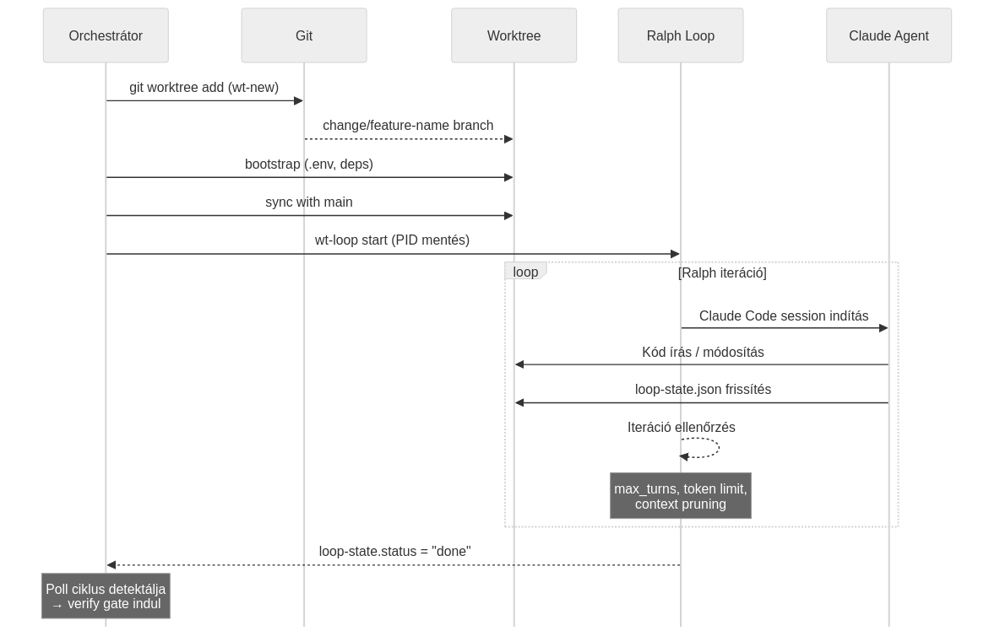

# Végrehajtás

## Dispatch: a change elindul

Amikor egy change minden függősége teljesült (merged státusz), a `dispatch_ready_changes()` elindítja a végrehajtást. A folyamat:

{width=95%}

### 1. Worktree létrehozás

```bash
set-new <change-name>
# → .claude/worktrees/<change-name>/
# → branch: change/<change-name>
```

A `set-new` egy izolált git worktree-t hoz létre, ahol az ágens szabadon dolgozhat anélkül, hogy a fő ágat érintené.

### 2. Bootstrap

A `bootstrap_worktree()` gondoskodik arról, hogy a worktree működőképes legyen:

- `.env` fájlok másolása a projekt gyökeréből
- Függőségek telepítése (ha `package-lock.json` újabb)
- Az `.env.local`, `.env.development` fájlok szintén átkerülnek

### 3. Szinkronizálás a fő ággal

A `sync_worktree_with_main()` biztosítja, hogy a worktree a legfrissebb main-re épüljön:

- Ha a worktree up-to-date → kihagyás
- Ha van eltérés → `git merge main` a worktree branch-be
- Generált fájlok (lock file, `.tsbuildinfo`) konfliktusa → automatikus `--ours` feloldás
- Valódi kód konfliktus → merge abort, figyelmeztetés

### 4. Ralph Loop indítás

```bash
set-loop start --change <name> --model <model_id> --max-turns <N>
```

A Ralph PID-je mentésre kerül az állapotfájlba.

## A Ralph Loop

A Ralph loop a `set-loop` paranccsal indul és egy iteratív fejlesztési ciklust hajt végre:

### Iterációs ciklus

Minden iterációban:

1. **Claude Code session** indul a worktree-ben
2. Az ágens megkapja a **scope**-ot (feladat leírás) és az opcionális **retry context**-et
3. Az ágens **kódot ír**, teszteket futtat, fájlokat módosít
4. A `loop-state.json` frissül az iteráció végén

### loop-state.json

Az iteráció állapota egy JSON fájlban:

```json
{
  "status": "running",           // running | done | error
  "iteration": 5,
  "max_turns": 20,
  "model": "claude-opus-4-6",
  "started_at": "2026-03-10T14:00:00Z",
  "tokens_used": 450000,
  "input_tokens": 300000,
  "output_tokens": 150000,
  "cache_read_tokens": 120000,
  "last_activity": "2026-03-10T14:15:30Z"
}
```

### Befejezési feltételek

A Ralph loop az alábbi esetekben áll le:

| Feltétel | Eredmény |
|----------|----------|
| Az ágens jelzi: kész | `status: "done"` |
| `max_turns` elérve | `status: "done"` (kényszerített) |
| Token limit elérve | `status: "done"` |
| Fatális hiba | `status: "error"` |

### Context Pruning

A `context_pruning: true` direktíva (alapértelmezett) lehetővé teszi a context window optimalizálást:

- Az ágens korábbi iterációinak kimenete összegződik
- A teljes konverzáció helyett csak a lényeges rész marad
- Ez csökkenti a token használatot és javítja a minőséget

## Model Routing

A `model_routing` direktíva lehetővé teszi, hogy különböző change-ek különböző modelleket használjanak:

- **`off`** (alapértelmezett): minden change a `default_model`-t használja
- Change-specifikus override a plan-ben: `"model": "sonnet"`

Tipikus konfiguráció:

```yaml
default_model: opus        # bonyolult feature-ök
review_model: sonnet       # code review (gyorsabb, olcsóbb)
summarize_model: haiku     # összegzés (leggyorsabb)
```

### Complexity alapú routing

A planner a `complexity` mezővel jelzi a change méretét:

| Complexity | Jellemző | Tipikus model |
|------------|----------|---------------|
| **S** (Small) | Config, docs, egyszerű fix | sonnet |
| **M** (Medium) | Feature, refactor | opus |
| **L** (Large) | Architektúra, cross-cutting | opus |

## Párhuzamos végrehajtás

A `max_parallel` direktíva szabályozza, hogy egyszerre hány worktree-ben dolgozhat ágens:

```
max_parallel: 3

T=0    [auth-system] ─────────────────────────── done → verify
T=0    [api-endpoints] ──────────────────── done → verify
T=0    [config-update] ──── done → verify → merge
T=15   [user-profile] ────────────────── (dispatch after auth merged)
T=30   [dashboard] ────────── (dispatch after slot free)
```

A dispatch logika:

1. Számold a `running` + `dispatched` + `verifying` change-eket
2. Ha kevesebb, mint `max_parallel` → keresd a következő kész change-et
3. Egy change "kész" ha: `pending` státuszú ÉS minden `depends_on` entry `merged`

\begin{fontos}
A párhuzamos végrehajtás nem jelenti, hogy az összes change egyszerre fut. A DAG és a max\_parallel együtt határozza meg a végrehajtási ütemezést. Egy 15 change-es plan 3 párhuzamossággal tipikusan 5-6 "hullámban" fut le.
\end{fontos}

## Pause és Resume

A futás bármikor felfüggeszthető és folytatható:

```bash
set-orchestrate pause auth-system    # egy change
set-orchestrate pause --all          # minden change
set-orchestrate resume auth-system   # folytatás
set-orchestrate resume --all         # minden folytatása
```

A `pause` megállítja a Ralph loop-ot (PID kill), de a worktree megmarad. A `resume` újraindítja a loop-ot, opcionálisan retry context-tel.

## Token tracking

Minden change token használata valós időben nyomon követhető:

- `tokens_used`: összes token (input + output)
- `input_tokens`, `output_tokens`: részletes bontás
- `cache_read_tokens`, `cache_create_tokens`: prompt cache statisztikák

A `_prev` mezők a korábbi iterációk összegét tárolják (restart után is pontos marad a számolás).
