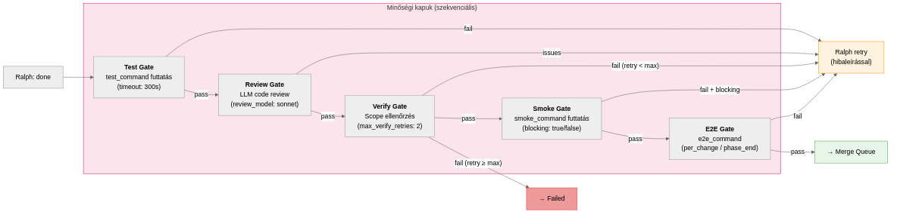

# Minőségi Kapuk

## Áttekintés

Amikor egy Ralph loop befejezi a munkáját (`loop-state.status == "done"`), a change nem kerül azonnal merge-re. Egy szekvenciális minőségi pipeline-on kell átmennie, ahol minden "gate" (kapu) ellenőrzi a munka egy aspektusát.

{width=95%}

## Test Gate

Az első és legfontosabb kapu. Ha van `test_command` konfigurálva, a rendszer futtatja a teszteket a worktree-ben.

### Működés

```bash
# A verifier.sh run_tests_in_worktree() függvénye:
cd <worktree_path>
timeout <test_timeout> bash -c "<test_command>"
```

### Paraméterek

| Paraméter | Alapértelmezés | Leírás |
|-----------|---------------|--------|
| `test_command` | "" (kihagyás) | A futtatandó teszt parancs |
| `test_timeout` | 300s | Timeout a teszt futtatásra |

### Kimenet kezelés

- **Pass** (exit code 0): Továbblépés a következő gate-re
- **Fail** (exit code nem 0): A teszt kimenet (max 2000 karakter) mentésre kerül, és a change visszakerül a Ralph loop-ba a hibaüzenettel mint retry context

A teszt statisztikák (`test_stats`) az állapotfájlba kerülnek:

```json
{
  "test_result": "pass",
  "test_stats": {
    "exit_code": 0,
    "duration_ms": 12500,
    "output_tail": "Tests: 42 passed, 42 total"
  }
}
```

## Review Gate

LLM-alapú code review, amelyet egy (tipikusan) kisebb és gyorsabb modell végez.

### Működés

A rendszer:

1. Összegyűjti a change-ben végrehajtott módosításokat (`git diff`)
2. Hozzáadja a change scope-ját és a hozzárendelt követelményeket
3. Elküldi a `review_model`-nek (alapértelmezés: sonnet)
4. Az LLM értékeli a kód minőségét

### Requirement-aware review

A `build_req_review_section()` a review prompthoz hozzáfűzi az érintett követelményeket:

```
## Assigned Requirements (this change owns these)
- REQ-001: JWT autentikáció — Token alapú auth a /api/* végpontokon
- REQ-004: Token refresh — Lejárt token automatikus frissítése

## Cross-Cutting Requirements (awareness only)
- REQ-012: Logging — Minden API hívás naplózása
```

Ez segíti az LLM-et abban, hogy ne csak a kód minőségét, hanem a **követelmény-megfelelőséget** is értékelje.

### Konfiguráció

| Paraméter | Alapértelmezés | Leírás |
|-----------|---------------|--------|
| `review_before_merge` | false | Review gate engedélyezése |
| `review_model` | sonnet | Review-hoz használt model |
| `skip_review` | false | Change-szintű kihagyás (plan-ben) |

## Verify Gate

A verify gate ellenőrzi, hogy az implementáció a scope-nak megfelel-e.

### Működés

A `verify_merge_scope()` függvény:

1. Összehasonlítja a tervezett scope-ot a tényleges módosításokkal
2. Ellenőrzi, hogy a lényeges változások megtörténtek-e
3. Azonosítja a nem kívánt mellékhatásokat (scope creep)

### Retry logika

Ha a verify gate sikertelen:

```
verify_retry_count < max_verify_retries?
  → igen: retry_context + Ralph loop újraindítás
  → nem: change → failed
```

A retry context tartalmazza a verify hibaüzenetet, a build kimenetet, és az eredeti scope-ot, hogy az ágens célzottan tudja javítani a problémát.

| Paraméter | Alapértelmezés | Leírás |
|-----------|---------------|--------|
| `max_verify_retries` | 2 | Maximum retry szám |

## Smoke Gate

A smoke test egy könnyű, gyors ellenőrzés, amely a build integritását vizsgálja.

### Működés

```bash
cd <worktree_path>
timeout <smoke_timeout> bash -c "<smoke_command>"
```

### Blocking vs Non-blocking

| Mód | Viselkedés |
|-----|-----------|
| `smoke_blocking: true` | Sikertelen smoke → Ralph retry (fix ciklus) |
| `smoke_blocking: false` | Sikertelen smoke → figyelmeztetés, de merge engedélyezett |

### Smoke fix ciklus

Ha a smoke test sikertelen és `smoke_blocking: true`:

1. A hiba leírása retry context-ként átadódik
2. Ralph loop indul a smoke fix-re (korlátozott budget)
3. Max `smoke_fix_max_retries` (alapértelmezés: 3) próbálkozás
4. Ha nem sikerül → change failed

| Paraméter | Alapértelmezés | Leírás |
|-----------|---------------|--------|
| `smoke_command` | "" | Smoke test parancs |
| `smoke_timeout` | 120s | Smoke timeout |
| `smoke_blocking` | true | Blocking mód |
| `smoke_fix_token_budget` | 500K | Fix budget |
| `smoke_fix_max_turns` | 15 | Max fix iteráció |
| `smoke_fix_max_retries` | 3 | Max retry |

### Health Check

Opcionálisan egy HTTP health check is konfigurálható:

```yaml
smoke_health_check_url: "http://localhost:3000/api/health"
smoke_health_check_timeout: 30
```

A rendszer a smoke test után ellenőrzi, hogy az alkalmazás HTTP válaszol-e.

## E2E Gate

A legátfogóbb teszt, amely a teljes alkalmazást vizsgálja.

### Két mód

| Mód | Leírás |
|-----|--------|
| `e2e_mode: per_change` | Minden change merge előtt fut az E2E |
| `e2e_mode: phase_end` | Az E2E csak a fázis végén fut, a main branch-en |

A `phase_end` mód hatékonyabb nagy projekteknél, mert az E2E tesztek gyakran lassúak és a fő ágon futva relevánsabb eredményt adnak.

| Paraméter | Alapértelmezés | Leírás |
|-----------|---------------|--------|
| `e2e_command` | "" | E2E teszt parancs |
| `e2e_timeout` | 600s | E2E timeout |
| `e2e_mode` | per_change | per_change/phase_end |

## A gate-ek sorrendje összefoglalva

```
Ralph done
  → Test Gate (test_command, ha van)
    → Review Gate (review_before_merge, ha aktív)
      → Verify Gate (scope ellenőrzés)
        → Smoke Gate (smoke_command, ha van)
          → E2E Gate (e2e_command, ha van)
            → ✓ Merge Queue
```

\begin{fontos}
Minden gate opcionális. Ha nincs test\_command, a Test Gate kimarad. Ha review\_before\_merge false, a Review Gate kimarad. A minimális konfiguráció (semmilyen gate) esetén a change a Ralph done után közvetlenül a merge queue-ba kerül — de ez éles projekteknél nem ajánlott.
\end{fontos}

## Hookak

A gate-ek között hookak futhatnak:

| Hook | Mikor fut |
|------|-----------|
| `hook_post_verify` | Verify gate pass után |
| `hook_pre_merge` | Merge előtt (blokkoló) |
| `hook_on_fail` | Change failed státuszba kerüléskor |
