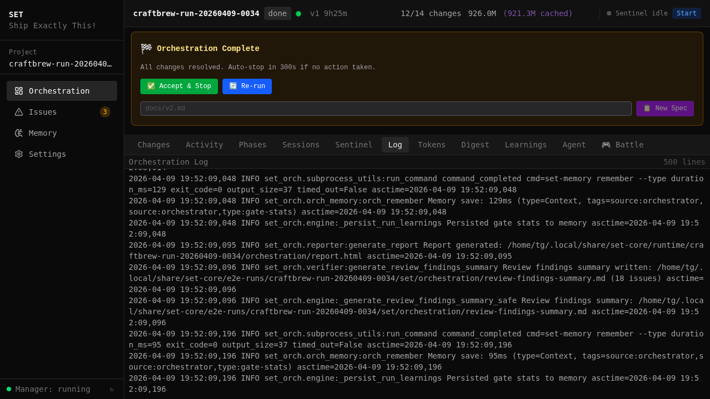

[< Back to Index](../INDEX.md)

# Benchmarks

Consolidated results from E2E orchestration runs — real applications built autonomously from spec to production-ready code.

---

## MiniShop — Autonomous Webshop

The hero benchmark: a Next.js 14 e-commerce storefront built with zero human intervention.

The sentinel received a product spec describing a webshop with product listings, cart, checkout, admin authentication, and admin CRUD. It decomposed the spec into 6 changes with a dependency graph, dispatched each to a worktree agent, ran quality gates on every change, and merged all results to main.

| Metric | Value |
|--------|-------|
| Changes planned | 6 |
| Changes merged | 6/6 (100%) |
| Wall clock time | 1h 45m |
| Active build time | ~1h 25m |
| Human interventions | 0 |
| Merge conflicts | 0 |
| Jest unit tests | 38 (6 suites) |
| Playwright E2E tests | 32 (6 spec files) |
| Git commits | 39 |
| Total tokens | 2.7M |
| Gate retries | 5 (all self-healed) |

### Self-Healing Gate Retries

The 5 gate retries demonstrate the auto-fix pipeline in action. Each failure was caught by a quality gate, diagnosed by the agent, and fixed without human help:

1. **Missing test file** — the agent generated component code but forgot the corresponding test file. The test gate failed, the agent read the error output, and added the missing test.
2. **Jest config issue** — a module alias was misconfigured in `jest.config.ts`. The build gate caught the import error, the agent fixed the path mapping.
3. **Playwright auth tests (3 specs)** — authentication middleware redirected unauthenticated requests differently than the E2E tests expected. The agent updated 3 Playwright spec files to match the actual redirect behavior.
4. **Post-merge type error** — after merging `admin-auth`, a type mismatch surfaced in the `orders-checkout` change because it depended on a shared type that `admin-auth` had modified. The agent synced with main and resolved the type.
5. **Cart test race condition** — a Playwright test clicked "Add to Cart" before the product data finished loading. The agent added a `waitForSelector` call to fix the timing.

### The Built Storefront

The orchestrator produces a complete, working application — not scaffolding or stubs. These screenshots were captured automatically from the running app after all changes merged.

| Page | Screenshot |
|------|-----------|
| Product listing |  |
| Product detail |  |
| Shopping cart |  |
| Admin login |  |
| Admin dashboard |  |
| Admin products (CRUD) |  |
| Order management |  |

Every page includes working data from a seeded database, functional navigation, and responsive layout. The admin panel has full CRUD for products, protected by authentication middleware.

---

## Quality Gate Results

Every change passes through a multi-stage verification pipeline before it is allowed to merge into main:

```
Agent completes --> Jest --> Build --> Playwright E2E --> Verify (OpenSpec) --> Merge --> Post-merge smoke
```

No change reaches main without green gates. The verify step checks spec coverage — ensuring the agent actually implemented what the planner specified, not just code that happens to build.


In the MiniShop run, total gate execution time was 422 seconds (12% of active build time). The gates caught 5 issues that agents then fixed autonomously. Without gates, those 5 issues would have merged broken code into main and cascaded into downstream changes.

### Gate Timing Breakdown

| Gate | Avg Duration | Purpose |
|------|-------------|---------|
| Jest (unit tests) | 8s | Catch logic errors early |
| Build (`next build`) | 35s | Type checking + bundle validation |
| Playwright E2E | 45s | Full browser-based integration tests |
| Spec verify (LLM) | 25s | Requirement coverage check |
| Post-merge smoke | 15s | Sanity check after merge to main |

The Jest gate runs first because it's the fastest feedback loop. Build catches type errors that tests might miss. Playwright E2E tests the actual user experience. Spec verify ensures completeness against the original requirements. Post-merge smoke catches integration issues that only surface when all changes combine.

---

## Token Usage

Token consumption across all 6 MiniShop changes:


| Change | Input | Output | Cache Read | Total |
|--------|-------|--------|------------|-------|
| project-infrastructure | 367K | 42K | 12.3M | 410K |
| products-page | 378K | 28K | 7.2M | 406K |
| cart-feature | 460K | 39K | 12.6M | 499K |
| admin-auth | 329K | 41K | 10.5M | 370K |
| orders-checkout | 312K | 36K | 10.5M | 348K |
| admin-products | 568K | 87K | 18.3M | 655K |
| **Total** | **2.4M** | **273K** | **71.4M** | **2.7M** |

The `admin-products` change consumed the most tokens (655K) because it was the last in the dependency chain and required the most context about existing code — it needed to understand the product model, the admin layout, the authentication middleware, and the existing CRUD patterns established by earlier changes.

Cache read tokens (71.4M) reflect prompt caching — the same project context is reused across turns within each agent session, keeping actual billed tokens low. Only input + output tokens are billed; cache reads represent reuse of previously cached context.

Average cost per change: ~450K tokens. For a 6-change project, this is roughly equivalent to 3--4 hours of manual senior developer work compressed into 1h 45m of wall clock time.

---

## Monitoring the Run

The web dashboard provides real-time visibility into every aspect of the orchestration run.

| View | What it shows | Screenshot |
|------|--------------|-----------|
| Changes tab | Status of all 6 changes, phase grouping, merge order |  |
| Phases tab | Gate progression per change, pass/fail/retry status |  |
| Tokens tab | Per-change token consumption chart |  |
| Sessions tab | Agent session list with duration and token totals |  |
| Sentinel tab | Supervisor decisions, restart events, stall detection |  |
| Log tab | Raw orchestrator output, searchable |  |
| Agent tab | Live agent terminal output |  |

### E2E Test Results

The agents write Playwright E2E tests as part of the implementation. Here's what a typical test report looks like after a completed orchestration run:


---

## Scale: MiniShop vs CraftBrew

The CraftBrew run (15 changes, 150+ source files, 28 database tables) tested the system at 2.5x the scale of MiniShop. CraftBrew run #7 completed all 15 changes (14/14 merged after one was consolidated) but exposed merge conflict handling as the key scaling bottleneck — cross-cutting files like Prisma schemas and i18n message bundles caused data loss during early conflict resolution attempts. This directly drove the development of:

- **Conservation checks** — verify no code is lost during merge conflict resolution
- **Entity counting** — count database models, API routes, and components before and after merge
- **Cross-cutting file protection** — special handling for files known to be modified by multiple changes
- **LLM-assisted conflict resolution** — use an LLM to resolve conflicts in complex files where line-by-line merge fails

| Metric | MiniShop | CraftBrew #7 | Factor |
|--------|----------|-------------|--------|
| Changes | 6 | 15 | 2.5x |
| Source files | 47 | 150+ | 3x |
| DB models | ~8 | 28 | 3.5x |
| Merge conflicts | 0 | 4 (all resolved) | -- |
| Human intervention | 0 | 0 | -- |
| Wall clock time | 1h 45m | ~6h | 3.4x |
| Total tokens | 2.7M | ~11M | 4x |

The token scaling is super-linear (4x tokens for 2.5x changes) because later changes in a large project require more context — every new change must understand the code produced by all previous changes.

---

## Reproducing Benchmarks

Benchmarks are reproducible using the E2E test infrastructure:

```bash
# Full automated run: scaffold project, init, register, start orchestration
./tests/e2e/run.sh minishop

# Or with manual start via the web manager UI
./tests/e2e/run.sh minishop --no-start
```

Each run produces a benchmark report with per-change metrics (tokens, duration, gate results, retry count) stored in the project's orchestration state. The web dashboard reads this state to render the visualizations shown above.

See [CLAUDE.md](../../CLAUDE.md) for detailed E2E run setup instructions.

---

*See also: [Journey](journey.md) · [Lessons Learned](lessons-learned.md) · [How It Works](how-it-works.md)*

<!-- specs: verify-gate, orchestration-engine, dispatch-core -->
