<!-- _class: title-slide -->
<!-- _footer: "" -->

# SET

**Autonomous multi-agent orchestration for Claude Code**

Give it a spec — get merged features.

*April 2026*

<!-- SPEAKER_NOTES:
Welcome and introduction. SET is a framework that takes a markdown
specification and uses parallel AI agents to build working applications.
Today I'll walk through the entire pipeline using a real E2E test.
-->

---

# Agenda

| Time | Topic |
|------|-------|
| 5 min | **The problem** — Why "prompt and pray" isn't enough |
| 10 min | **Six pillars** — SPECIFY, DECOMPOSE, EXECUTE, SUPERVISE, VERIFY, LEARN |
| 5 min | **The input** — Spec + Design = quality input |
| 15 min | **E2E Demo: MiniShop** — Walking through the full pipeline |
| 5 min | **Works everywhere** — Greenfield, brownfield, isolated unit |
| 5 min | **Dashboard & Monitoring** — Real-time visibility |
| 5 min | **Lessons learned** — 100+ runs in production |
| 5 min | **Roadmap** — Where we're heading |

<!-- SPEAKER_NOTES:
The backbone of this talk is the MiniShop E2E demo — building a real
webshop from a specification with zero human intervention. Through that
demo I'll show every component of the system.
-->

---

<!-- _class: section-divider -->

# 1. The problem

*Why isn't prompting enough?*

---

# AI coding today — the challenges

| Problem | Typical approach | Result |
|---------|------------------|--------|
| **Divergence** | Run prompt twice = two different results | Not reproducible |
| **Hallucination** | Agents make up what they don't know | Missing features |
| **Quality roulette** | LLM judges code quality | Inconsistent |
| **Spec drift** | "Tests pass" ≠ "spec is satisfied" | Partial implementation |
| **Amnesia** | Every session starts from scratch | Repeated mistakes |
| **Bug fixing** | Manual debugging, hours | Lost time |

> Most AI coding tools are **non-deterministic** — same prompt, different result.
> SET treats this as an engineering problem.

<!-- SPEAKER_NOTES:
This isn't theoretical. In early CraftBrew runs, three different agents
chose three different table libraries, two skipped pagination entirely,
and one implemented delete but not edit.
-->

---

# How SET addresses it

| Challenge | SET solution | Result |
|-----------|-------------|--------|
| **Divergence** | 3-layer template system | **83-87%** structural convergence |
| **Hallucination** | OpenSpec workflow + acceptance criteria | Implements against the spec |
| **Quality roulette** | Programmatic gates (exit codes, not LLM judgment) | Deterministic pass/fail |
| **Spec drift** | Coverage tracking + auto-replan | 100% spec coverage |
| **Amnesia** | Hook-driven memory (5 layers) | 100% context capture |
| **Bug fixing** | Issue pipeline: detect → investigate → fix | **30 second** recovery |

> **"We don't prompt — we specify."**

<!-- SPEAKER_NOTES:
The key is specification-driven development. We don't tell the agent
"build an admin panel" — we give it 8 requirements with acceptance
criteria, and the verify gate checks all 8.
-->

---

<!-- _class: section-divider -->

# 2. Six pillars

*The architecture behind it*

---

# SPECIFY > DECOMPOSE > EXECUTE > SUPERVISE > VERIFY > LEARN

```
┌───────────┬───────────┬───────────┬───────────┬───────────┬───────────┐
│  SPECIFY  │ DECOMPOSE │  EXECUTE  │ SUPERVISE │  VERIFY   │   LEARN   │
│           │           │           │           │           │           │
│ Structured│ Intelli-  │ Structured│ Three-tier│ Determ.   │ Every run │
│ input,    │ gent plan,│ implem.,  │ supervis.,│ quality,  │ improves  │
│ not       │ not       │ not free  │ not baby- │ not LLM   │ the next  │
│ prompts   │ guessing  │ rein      │ sitting   │ vibes     │           │
└───────────┴───────────┴───────────┴───────────┴───────────┴───────────┘
```

> Every feature, gate, and automation maps to one of these six pillars.

<!-- SPEAKER_NOTES:
These six pillars are the mental model of the system. They're not marketing —
each one has a concrete failure story behind it. For a CTO, this is the most
important 5 minutes: if they understand this, everything else falls into place.
-->

---

# Change lifecycle — state machine

```
                  ┌─────────────────────────────────────────────────┐
                  │              SPECIFY + DECOMPOSE                │
     spec.md ────►│  digest ──► triage ──► plan (DAG) ──► dispatch │
                  └──────────────────────────┬──────────────────────┘
                                             │
                  ┌──────────────────────────▼──────────────────────┐
                  │              EXECUTE (per change)               │
                  │  pending ──► dispatched ──► running             │
                  │                             │                   │
                  │              Ralph Loop:    │                   │
                  │              proposal ──► design ──► spec       │
                  │              ──► tasks ──► code ──► test        │
                  └──────────────────────────┬──────────────────────┘
                                             │
                  ┌──────────────────────────▼──────────────────────┐
                  │              VERIFY                             │
                  │  test ──► build ──► E2E ──► review              │
                  │  ──► spec_coverage ──► smoke                    │
                  │       │                                         │
                  │       ├─ PASS ──► merge_queue                   │
                  │       └─ FAIL ──► agent fixes ──► VERIFY again  │
                  └──────────────────────────┬──────────────────────┘
                                             │
                  ┌──────────────────────────▼──────────────────────┐
                  │              SUPERVISE + LEARN                  │
                  │  merge (FF-only) ──► post-merge smoke           │
                  │  ──► coverage check                             │
                  │       │                                         │
                  │       ├─ 100% ──► done                          │
                  │       └─ <100% ──► REPLAN ──► new DECOMPOSE     │
                  └─────────────────────────────────────────────────┘
```

<!-- SPEAKER_NOTES:
This state machine is the full lifecycle. The key insight: every change
goes through this, and the system doesn't stop until the spec is 100%
covered. If a gate fails, the agent fixes it — not us. If coverage is
under 100%, new changes are dispatched automatically.
-->

---

# Gradual escalation — when things break

```
  Normal operation
       │
       ▼
  ┌─ L1: Warning ──────────────── Log + notification, no intervention
  │
  ├─ L2: Restart ──────────────── Agent restart with context pruning (~70% success)
  │
  ├─ L3: Redispatch ───────────── Full worktree rebuild (max 2x)
  │
  └─ L4: Give up ──────────────── Change → failed (better than burning tokens)
```

The watchdog is **context-aware**:
- `pnpm install` 90s without stdout? → Grace period (not a stall)
- Prisma migration running? → Extended timeout
- Not "no output = dead" — that killed an agent mid-Prisma once. Never again.

<!-- SPEAKER_NOTES:
Gradual escalation comes from a 25-year-old SMS gateway pattern.
L2 (restart with fresh context) solves the problem 70% of the time.
L4 (give up) is the last resort — better to lose one change than
burn unlimited tokens.
-->

---

<!-- _class: section-divider -->

# 3. The input

*Output quality depends on input quality*

---

# What a good spec looks like

```
spec.md
├── Data model         -- entities, fields, relations, enums
├── Pages              -- sections, columns, components
├── Design tokens      -- hex colors, fonts, spacing values
├── Auth & roles       -- protected routes, registration
├── Seed data          -- realistic names, not "Product 1"
├── i18n               -- locales, URL structure
└── Business reqs      -- user stories, acceptance criteria
```

> **You are the product owner, the agents are the dev team, the spec is the sprint backlog.**
> The difference: this sprint takes hours, not weeks.

<!-- SPEAKER_NOTES:
A spec is not a sketch — it's a detailed requirements document.
We have an interactive spec writer (/set:write-spec) that walks through
the project-type-specific sections.
-->

---

# Spec + Figma Design

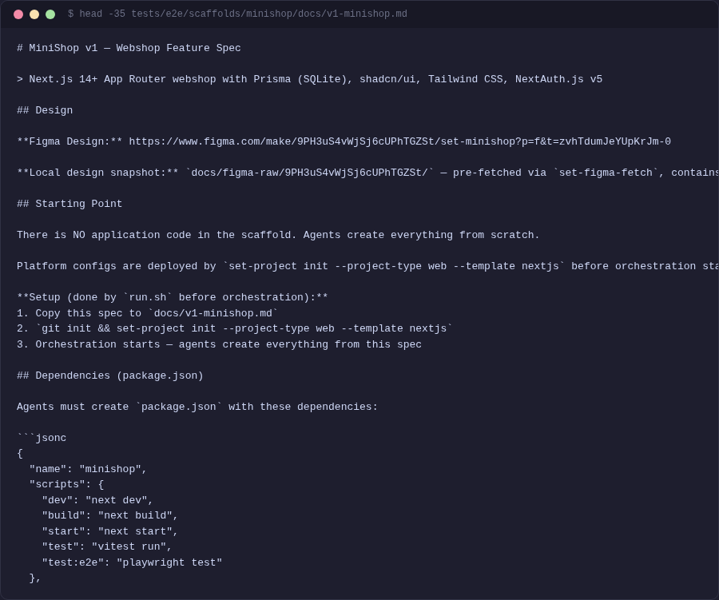 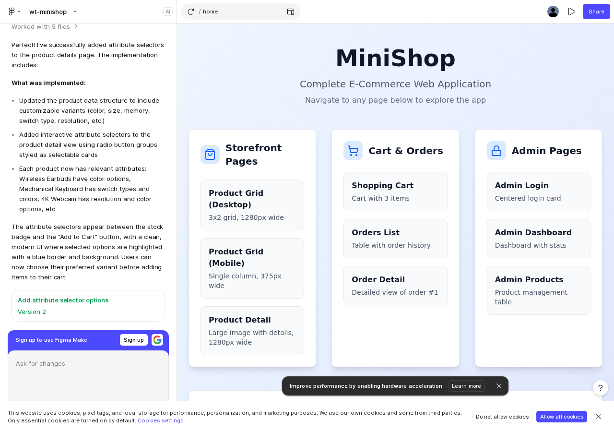

**Left:** Markdown spec — the business requirements
**Right:** Figma Make design — the visual blueprint

The `set-design-sync` tool extracts design tokens (colors, fonts, spacing) from Figma into `design-system.md` — agents read this before implementation.

<!-- SPEAKER_NOTES:
Figma Make is a simple design tool. set-design-sync extracts tokens
and visual descriptions, which the dispatcher distributes to each agent
based on their scope.
-->

---

<!-- _class: section-divider -->

# 4. E2E Demo: MiniShop

*Building a webshop from a spec — live*

---

# MiniShop — the task

A **Next.js 14 e-commerce application** — built entirely from a spec:

- Product listing and detail pages
- Shopping cart (add, remove, update quantity)
- Checkout and order management
- Admin authentication (login, registration)
- Admin CRUD (product management)
- Seeded database with realistic data

**Question:** How long does it take, how many bugs, how much human intervention?

<!-- SPEAKER_NOTES:
This is not a toy example — a real Next.js application with Prisma ORM,
Playwright E2E tests, admin panel. We use this as a regression test
before every major release.
-->

---

# The pipeline

```
spec.md ──> digest ──> decompose ──> parallel agents ──> verify ──> merge ──> done
```

```
spec.md + design-snapshot.md (Figma)
  │
  ▼
┌─────────────────────────────────────────────────────────────┐
│ Sentinel (autonomous supervisor)                            │
│  ├─ digest: spec → requirements + domain summaries          │
│  ├─ decompose: independent changes (DAG)                    │
│  ├─ dispatch: into git worktrees in parallel                │
│  ├─ monitor: 15s polling, crash recovery                    │
│  ├─ verify: quality gates per change                        │
│  ├─ merge: FF-only + post-merge smoke                       │
│  └─ replan: until spec is 100% covered                      │
└─────────────────────────────────────────────────────────────┘
```

<!-- SPEAKER_NOTES:
7-stage pipeline. Every stage is automatic. The Sentinel is the top-level
supervisor — watching for crashes, stalls, and automatic restarts.
-->

---

# Step 1: Digest — Extracting requirements

The digest module extracts from the spec:
- **Domains** (e.g., Products, Cart, Auth, Admin)
- **Requirements** per domain (e.g., 32 reqs)
- **Acceptance criteria** (e.g., 84 WHEN/THEN)

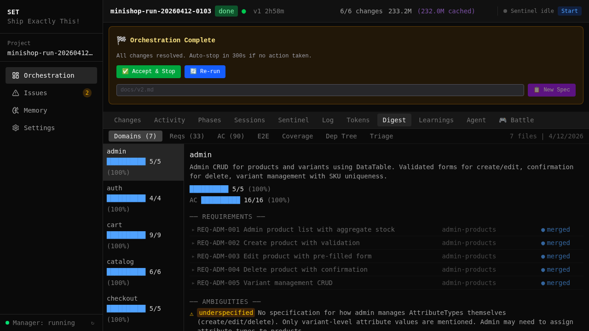

> Every requirement gets a `[REQ: ...]` ID — we track it through the entire pipeline.

<!-- SPEAKER_NOTES:
The digest tab on the dashboard shows all extracted requirements.
The verify gate later checks every REQ for implementation.
If something is missing, auto-replan kicks in.
-->

---

# Step 2: Decompose — Independent changes

The planner creates **independently implementable changes** from requirements:

| Change | Depends on | Size |
|--------|-----------|------|
| `project-infrastructure` | -- | Base structure, config |
| `products-page` | infrastructure | Product list + details |
| `cart-feature` | products | Cart functionality |
| `admin-auth` | infrastructure | Admin login |
| `orders-checkout` | cart, admin-auth | Orders + checkout |
| `admin-products` | admin-auth, products | Admin CRUD |

**Dependency DAG** — broken into phases:
- **Phase 1:** infrastructure (base)
- **Phase 2:** products + admin-auth (parallel!)
- **Phase 3:** cart + orders + admin-products

<!-- SPEAKER_NOTES:
The dependency DAG is the key to parallel execution. In phase 2,
products and admin-auth can run simultaneously because they don't
depend on each other. This cuts run time by ~40%.
-->

---

# Step 3: Dispatch — Parallel agents

Each change gets its own **git worktree** — an isolated dev environment:

```
main/
├── .worktrees/
│   ├── project-infrastructure/   ← Agent 1
│   ├── products-page/            ← Agent 2
│   ├── admin-auth/               ← Agent 3 (parallel with #2!)
│   ├── cart-feature/             ← Agent 4
│   ├── orders-checkout/          ← Agent 5
│   └── admin-products/           ← Agent 6
```

Inside each agent the **Ralph Loop** runs:
```
proposal → design → spec → tasks → implementation → tests → done
```

> One agent = one change = one worktree = full isolation.

<!-- SPEAKER_NOTES:
Git worktrees are the key — each agent works on its own branch,
they can't interfere. The Ralph Loop is the OpenSpec workflow inside
the agent: structured artifacts, not free-form prompting.
-->

---

# Step 4: Monitor — Real-time supervision

The Sentinel polls every agent **every 15 seconds**:

- **Progress tracking** — where is each change?
- **Stall detection** — no progress for >120s → investigation
- **Crash recovery** — PID gone? → diagnose → restart
- **Token tracking** — cost monitoring per change

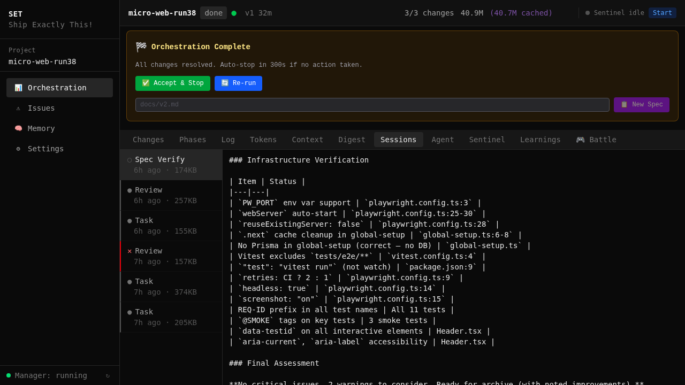

<!-- SPEAKER_NOTES:
The sessions tab shows all agent sessions: duration, token usage,
iteration count. If an agent gets stuck, the sentinel automatically
launches an investigation.
-->

---

# Meanwhile the agent works...

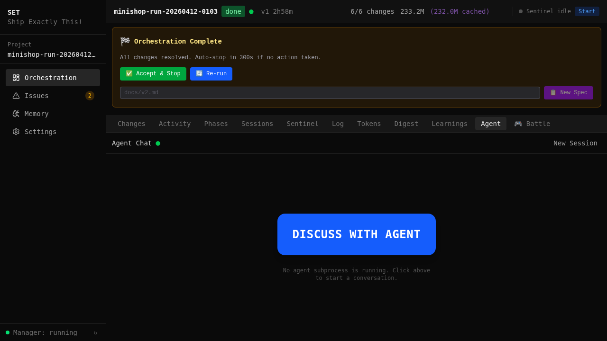

The Agent tab shows the **real-time terminal output** — code writing, testing, debugging.

<!-- SPEAKER_NOTES:
You can see the agent implementing: writing files, running tests,
fixing bugs. This is not a black box — every step is observable.
The agent-session-scroll.gif shows this in motion.
-->

---

# Step 5: Verify — Quality Gates

Each change passes **6 gates** before merge:

```
Jest/Vitest (8s) → Build (35s) → Playwright E2E (45s)
    → Code Review (25s) → Spec Coverage → Post-merge Smoke (15s)
```

| Gate | Time | Checks | Type |
|------|------|--------|------|
| **Test** | 8s | Unit/integration tests | Deterministic (exit code) |
| **Build** | 35s | Type check + bundle | Deterministic (exit code) |
| **E2E** | 45s | Browser-based tests | Deterministic (exit code) |
| **Review** | 25s | Code quality | LLM (CRITICAL = fail) |
| **Spec Coverage** | -- | Requirement coverage | LLM + pattern match |
| **Smoke** | 15s | Post-merge sanity check | Deterministic |

> **Total gate time: 422 seconds** (12% of build time)

<!-- SPEAKER_NOTES:
Gates run in order, fastest first. If Jest fails, you don't wait
45 seconds for Playwright. The point: programmatic checks, not LLM
judgment. Exit code 0 is unambiguous — you can't talk past a failing gate.
-->

---

# Self-Healing: 5 gate failures, 5 automatic fixes

The MiniShop run had **5 gate failures** — all auto-fixed:

| # | Failure | Gate | Fix |
|---|---------|------|-----|
| 1 | Missing test file | Test | Agent added the test file |
| 2 | Jest config error | Build | Agent fixed the path mapping |
| 3 | Playwright auth tests (3 specs) | E2E | Agent updated the redirects |
| 4 | Post-merge type error | Build | Agent synced with main |
| 5 | Cart test race condition | E2E | Agent added `waitForSelector` |

> Without gates, these **5 bugs would have merged into main** and caused cascading failures.

<!-- SPEAKER_NOTES:
This is the essence of the self-healing pipeline: the gate catches
the bug, the agent reads the error, fixes it, and re-runs the gate.
No human intervention. #3 is particularly interesting: 3 Playwright
specs needed updating because the auth middleware redirected
differently than the tests expected.
-->

---

# Step 6: Merge — Integration

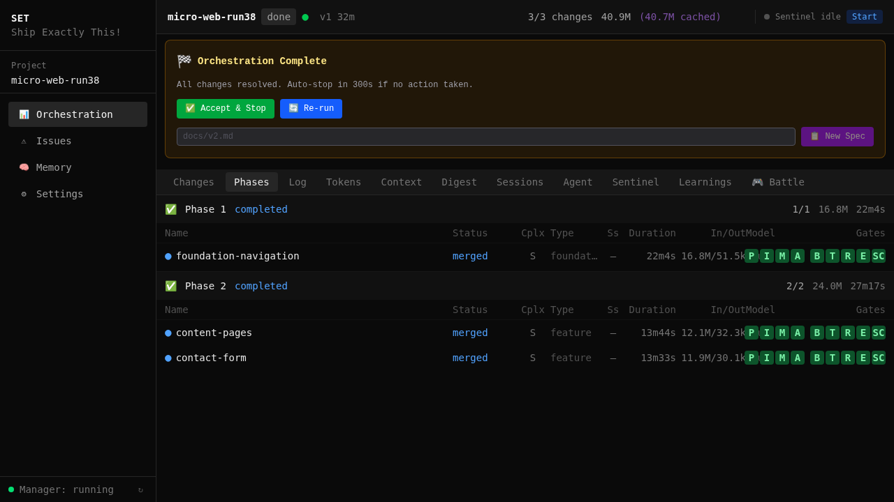

- **FF-only merge** — no merge commits, clean history
- **Sequential merge queue** — never parallel merges
- **Phase ordering** — phase 2 only starts after phase 1 merged
- **Post-merge smoke test** — sanity check after every merge

> The merge queue is the integration bottleneck — **intentionally**.
> A bad merge causes cascading failures.

<!-- SPEAKER_NOTES:
The phases tab shows gate badges: B=Build, T=Test, E=E2E, R=Review, V=Verify.
All green = all gates passed. Phase ordering ensures agents always
work on the latest main.
-->

---

# Step 7: Replan — 100% coverage

```
                    ┌──── coverage < 100%? ────┐
                    │                          │
merge ──► coverage check ──► done          replan
                                              │
                                    decompose again
                                    for missing REQs
```

The replan gate checks:
- Has every `[REQ: ...]` been implemented?
- Are there uncovered domains?
- If yes: **automatic planning of new changes** for the gaps

> The system doesn't stop until the spec is 100% covered.

<!-- SPEAKER_NOTES:
This replan gate is what sets SET apart: it's not enough that the code
compiles and tests pass — every spec point must be implemented.
If something is missing, a new change automatically starts for it.
-->

---

<!-- _class: section-divider -->

# Works everywhere

*Not just "build me an app from scratch"*

---

# Greenfield, Brownfield, Isolated Unit

| Mode | What it means | Example |
|------|---------------|---------|
| **Greenfield** | Full app from spec + design | MiniShop: 6/6 merged, 1h 45m, 0 interventions |
| **Brownfield** | Existing codebase + new features | SET builds itself: 1,500+ commits, 376 specs |
| **Isolated unit** | One module, one feature, one fix | "3 API endpoints with auth in my existing Next.js" |

The pipeline is **the same** in all three modes:
- Worktree isolation (even with 1 change)
- Quality gates (runs your existing tests too)
- The system **reads existing code** before doing anything

> The entry barrier is not a 30-page spec. It can be a single task description.

<!-- SPEAKER_NOTES:
This is important for CTOs: you don't need a full greenfield project.
SET works on existing codebases. We use it ourselves this way —
set-core is built with set-core, in brownfield mode.
-->

---

<!-- _class: section-divider -->

# The result

*What the pipeline produced*

---

# MiniShop — the finished application

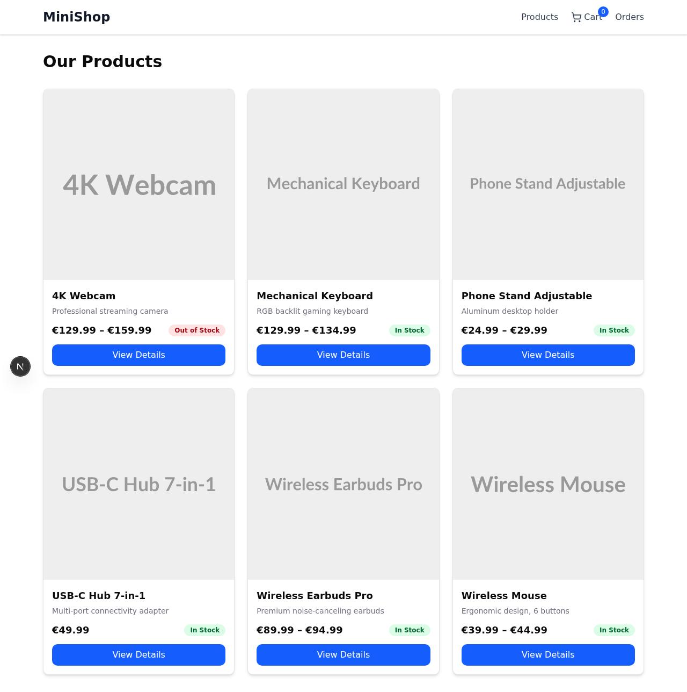 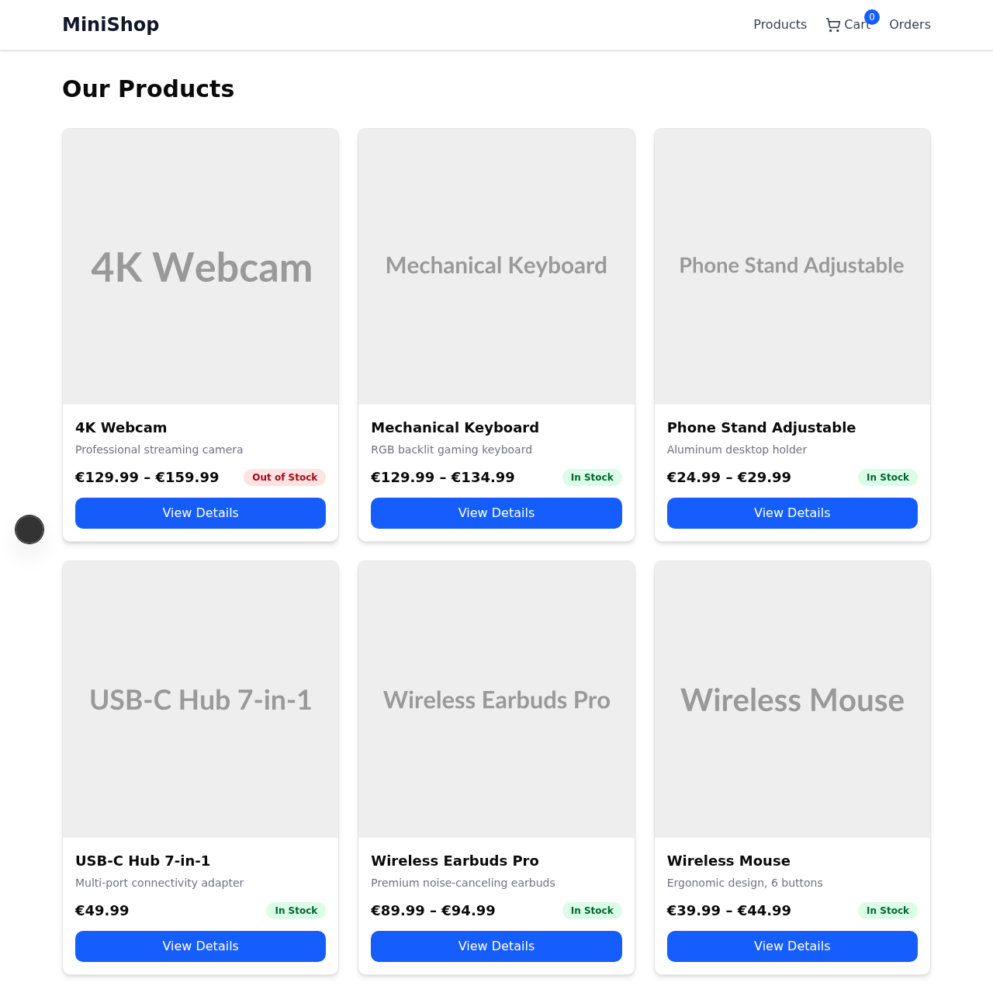

**Product listing** and **product details** — real data, working navigation.

<!-- SPEAKER_NOTES:
These app screenshots were AUTOMATICALLY captured at the end of the run.
The seed data contains realistic product names and descriptions,
not placeholder text.
-->

---

# MiniShop — Cart and Admin

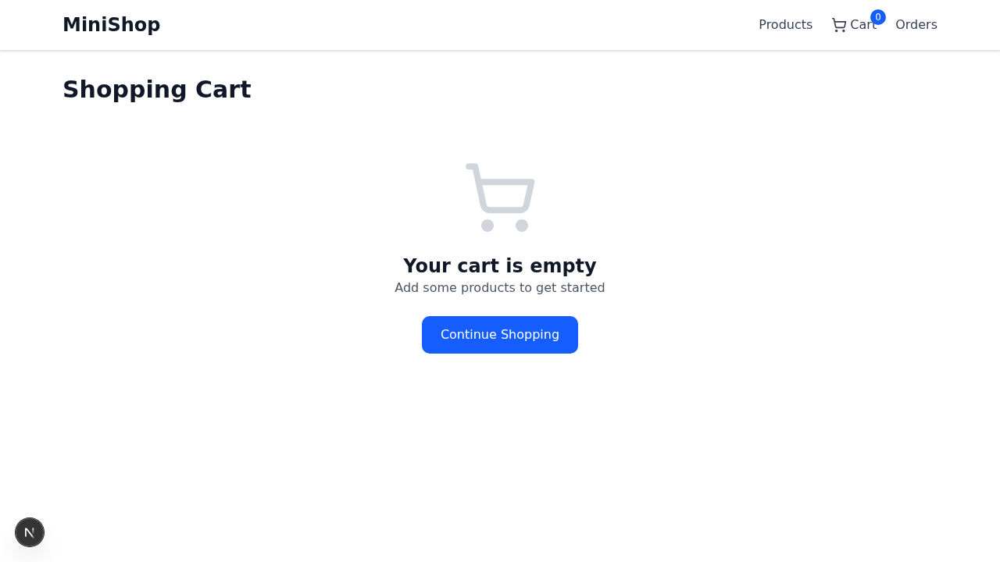 

**Left:** Working cart — quantity update, totals
**Right:** Admin dashboard — protected route, session-based auth

<!-- SPEAKER_NOTES:
The cart works with client-side state management, the admin panel
is protected by session-based authentication. The middleware
automatically redirects unauthenticated users.
-->

---

# MiniShop — Admin CRUD and Orders

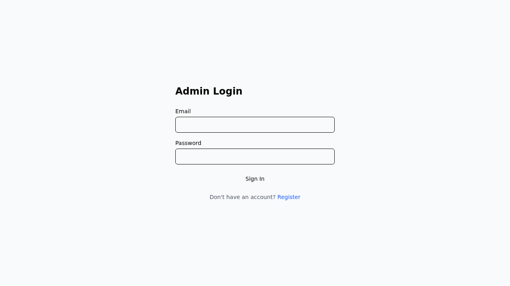 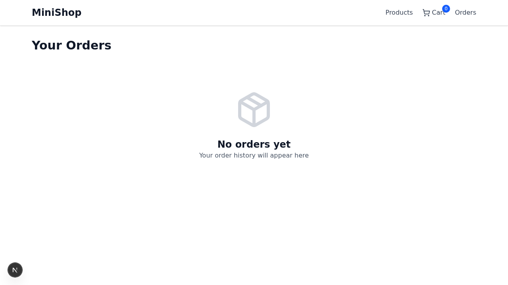

**Left:** Product CRUD (create, edit, delete)
**Right:** Order management — statuses, filtering

> Every page has a **working database**, **functional navigation**, and **responsive layout**.

<!-- SPEAKER_NOTES:
This is not scaffolding or stubs — a working application. Prisma ORM
manages the database, the seed script populates it with realistic data.
-->

---

# The numbers

| Metric | Value |
|--------|-------|
| Planned changes | **6** |
| Successfully merged | **6/6 (100%)** |
| Total wall time | **1h 45m** |
| Active build time | ~1h 25m |
| Human interventions | **0** |
| Merge conflicts | **0** |
| Jest unit tests | 38 (6 suites) |
| Playwright E2E tests | 32 (6 spec files) |
| Git commits | 39 |
| Total tokens | 2.7M |
| Gate retries | 5 (all self-healed) |

<!-- SPEAKER_NOTES:
1h 45m, 6 changes, 0 intervention, 70 tests (38 unit + 32 E2E).
This is roughly equivalent to a day's work by 3-4 senior developers.
-->

---

# Token usage

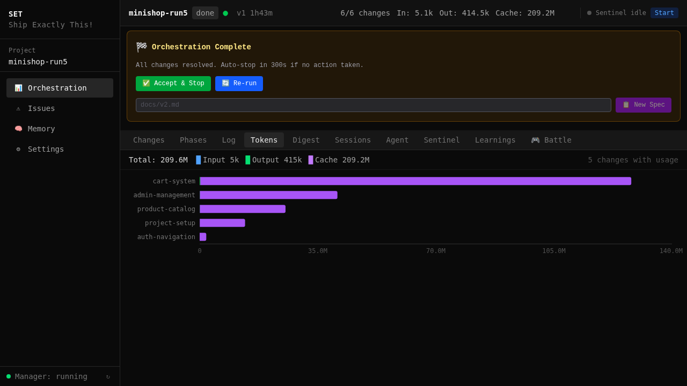

| Change | Input | Output | Cache | Total |
|--------|-------|--------|-------|-------|
| project-infrastructure | 367K | 42K | 12.3M | 410K |
| products-page | 378K | 28K | 7.2M | 406K |
| cart-feature | 460K | 39K | 12.6M | 499K |
| admin-auth | 329K | 41K | 10.5M | 370K |
| orders-checkout | 312K | 36K | 10.5M | 348K |
| admin-products | 568K | 87K | 18.3M | 655K |
| **Total** | **2.4M** | **273K** | **71.4M** | **2.7M** |

> Cache ratio: **26:1** — prompt caching dramatically reduces cost.

<!-- SPEAKER_NOTES:
admin-products used the most tokens (655K) because it was at the end
of the dependency chain — it had to understand all the previous code.
The cache read tokens (71.4M) are not billed — prompt caching reuses
already-cached context.
-->

---

<!-- _class: section-divider -->

# 5. Quality Gates

*Deterministic quality assurance*

---

# Why isn't LLM code review enough?

**Early experiments** (CraftBrew run #3):
- LLM-based code review gate
- Agents "gamed" the reviewer (verbose comments = good code)
- A `TODO: implement later` slipped through and broke checkout
- Inconsistent pass/fail decisions

**The solution:**
- **Test, Build, E2E** = exit code 0 or not = **deterministic**
- A failing Jest test is unambiguous — you can't argue with it
- A `next build` returning exit code 1 doesn't lie
- Only spec coverage stayed LLM-based (with explicit PASS/FAIL parsing)

> **Gates run in fast order** — if Jest fails, no waiting for Playwright.

<!-- SPEAKER_NOTES:
This was an important architectural decision: quality assurance is
not LLM judgment. Exit codes are objective, not subjective. This is
what makes autonomous operation possible — no human review needed
for every change.
-->

---

# Gate Profiles — customization

Not every change needs every gate:

| Change type | Test | Build | E2E | Review | Coverage |
|-------------|------|-------|-----|--------|----------|
| Feature | HARD | HARD | HARD | HARD | HARD |
| Bugfix | HARD | HARD | SOFT | HARD | SOFT |
| Cleanup | SOFT | HARD | SKIP | SOFT | SKIP |
| Config | SKIP | HARD | SKIP | SOFT | SKIP |

- **HARD** — fail = block merge
- **SOFT** — fail = warning, doesn't block
- **SKIP** — doesn't run

> The profile system is extensible via the `ProjectType` ABC.

<!-- SPEAKER_NOTES:
Gate profiles reduce unnecessary gate runs. A config change doesn't
need a Playwright E2E test. The profile is determined by the planner
based on the change type.
-->

---

# Playwright E2E tests

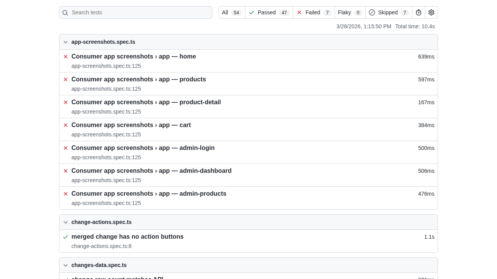

Agents **write the Playwright tests themselves** as part of the implementation.
The gate runs them — if they fail, the agent fixes them.

> 32 E2E tests in MiniShop — product listing, cart, checkout, admin, auth.

<!-- SPEAKER_NOTES:
The Playwright report was captured automatically. The tests run in
a real browser with real HTTP requests. This is not mocking — it's
testing the actual application.
-->

---

<!-- _class: section-divider -->

# 6. Dashboard & Monitoring

*Real-time visibility into everything*

---

# Web Dashboard — Overview

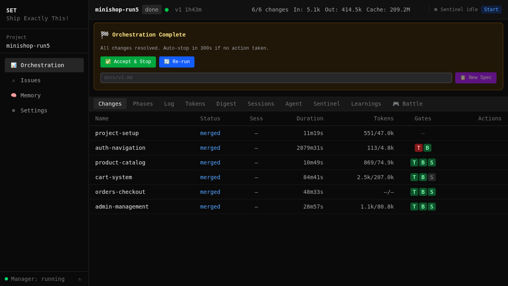

The dashboard lives at **http://localhost:7400** — real-time orchestration supervision.

<!-- SPEAKER_NOTES:
The dashboard is built with Next.js + React + Tailwind CSS.
The manager view shows all registered projects and their status.
-->

---

# Dashboard tabs

| Tab | What it shows |
|-----|---------------|
| **Changes** | Status of all changes, phase, merge order |
| **Phases** | Dependency tree, gate badges (B/T/E/R/V) |
| **Tokens** | Per-change token usage chart |
| **Sessions** | Agent session list, duration, tokens |
| **Sentinel** | Supervisor decisions, restart, stall |
| **Log** | Raw orchestrator output, searchable |
| **Agent** | Live agent terminal |
| **Learnings** | Lessons, gate failures |
| **Digest** | Requirements + coverage |

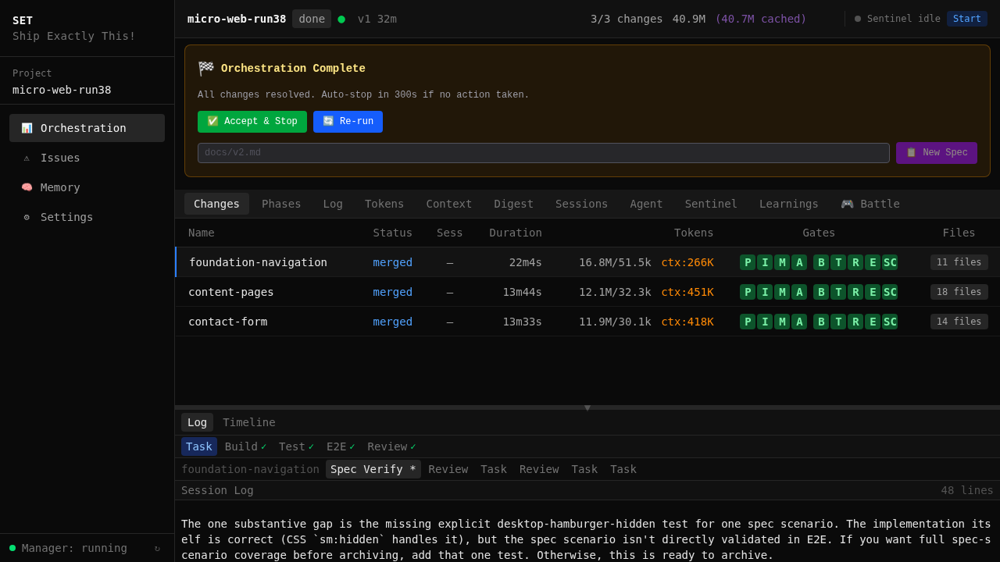 

<!-- SPEAKER_NOTES:
The Changes tab is the most-used — at a glance you see where every
change is. The Learnings tab collects insights: gate failures,
agent solutions, patterns the system has learned.
-->

---

# Sentinel supervision


The Sentinel **3-tier supervision model**:
1. **Agents** handle code errors
2. **Orchestrator** handles workflow errors
3. **Sentinel** handles infrastructure errors

| Event | Sentinel action |
|-------|----------------|
| `done` | Stop |
| `checkpoint` | Auto-approve or escalate |
| `crash` | Diagnose → restart |
| `stale` (>120s) | Launch investigation |

<!-- SPEAKER_NOTES:
The sentinel is the "night watchman" — running overnight, it ensures
nothing stops. A crash is detected within 30 seconds, diagnosed,
and restarted.
-->

---

<!-- _class: section-divider -->

# 7. Architecture

*3 layers, extensible plugin system*

---

# 3-layer architecture

```
┌─────────────────────────────────────────────────────────────┐
│ Layer 3: External Plugins (separate repos)                  │
│  └─ e.g., set-project-fintech (IDOR, PCI compliance)        │
├─────────────────────────────────────────────────────────────┤
│ Layer 2: Built-in Modules (modules/)                        │
│  ├─ web/    → WebProjectType: Next.js, Prisma, Playwright   │
│  └─ example/ → DungeonProjectType: reference implementation │
├─────────────────────────────────────────────────────────────┤
│ Layer 1: Core (lib/set_orch/)                               │
│  ├─ engine.py      → State machine, orchestration           │
│  ├─ dispatcher.py  → Worktree creation, agent dispatch      │
│  ├─ merger.py      → Merge queue, integration gates         │
│  ├─ verifier.py    → Quality gates (test/build/E2E/...)     │
│  ├─ planner.py     → Spec decomposition, DAG generation     │
│  └─ digest.py      → Requirement extraction                 │
└─────────────────────────────────────────────────────────────┘
```

> **Layer 1** never contains project-specific logic.
> All web/framework-specific code lives in **Layer 2**.

<!-- SPEAKER_NOTES:
This is the most important architectural rule: the core stays abstract.
If someone wants a fintech project, they create a set-project-fintech
plugin with IDOR checks and PCI compliance rules. The core knows nothing
about it.
-->

---

# Project size

```
set-core/
├── lib/set_orch/     59K Python LOC    ← Core engine
├── modules/web/       5K Python LOC    ← Web plugin
├── mcp-server/       30K LOC           ← MCP server
├── web/              14K TypeScript    ← Dashboard
├── bin/              15K Shell         ← 57 CLI tools
├── openspec/specs/   23K LOC           ← 376 specifications
├── docs/             22K LOC           ← Documentation
└── templates/core/    3K LOC           ← Deployed rules
                    ─────
                    134K LOC total
```

| Statistic | Value |
|-----------|-------|
| Development time | 1,000+ hours |
| Commits | 1,500+ (~17/day) |
| Specifications | 376 |
| E2E runs | 100+ |

> **Built with itself** — set-core is developed using its own orchestration pipeline.

<!-- SPEAKER_NOTES:
This is "dogfooding" — we develop set-core with set-core. Every feature
goes through OpenSpec workflow, passes quality gates, and is supervised
by the sentinel. If something breaks in orchestration, we hit it first.
-->

---

<!-- _class: section-divider -->

# 8. Lessons learned

*100+ runs, real production experience*

---

# 8 lessons from production

**1. Agents need structure, not just prompts**
- OpenSpec artifacts (proposal → spec → tasks) keep them focused
- Without it: 3 agents, 3 different table libraries

**2. Quality gates must be deterministic**
- Exit code > LLM judgment
- Agents gamed the LLM review

**3. Merge conflicts are the #1 cascading failure**
- Phase ordering + dependency DAG + sequential merge queue
- Cross-cutting files: Prisma schema, i18n bundle, middleware

**4. Memory without hooks is useless**
- 15+ sessions, **0 voluntary saves** by agents
- 5-layer hook infrastructure: +34% improvement

<!-- SPEAKER_NOTES:
We learned all of these the hard way. #4 was particularly surprising:
agents never voluntarily save memory, no matter how often we ask.
The hook infrastructure automatically extracts and saves insights.
-->

---

# 8 lessons (continued)

**5. E2E testing reveals what unit tests don't**
- Stale lock files, zombie worktrees, race condition in poll cycle
- Token counter overflow at 10M+ cache tokens

**6. Stall detection needs grace periods**
- `pnpm install` >60s without stdout → watchdog killed it
- Context-aware timeouts: install=120s, codegen=90s, MCP=60s

**7. The Sentinel pays for itself**
- 3 overnight runs lost to crashes before the sentinel
- 5-10 LLM calls per run, saves hours

**8. Templates beat conventions**
- "Make a Next.js project" = 5 different directory structures
- 3-layer template system: **0% structural divergence**

<!-- SPEAKER_NOTES:
#7 is the most important from a ROI perspective: a sentinel costs
~5-10 LLM calls per run, but a crash without it = 4-6 hours of lost
compute. #8 is the key to reproducibility: it's not enough to tell
the agent where to put files — you have to give them the structure.
-->

---

# Scaling: MiniShop vs CraftBrew

| Metric | MiniShop | CraftBrew #7 | Multiplier |
|--------|----------|-------------|------------|
| Changes | 6 | 15 | 2.5x |
| Source files | 47 | 150+ | 3x |
| DB models | ~8 | 28 | 3.5x |
| Merge conflicts | 0 | 4 (all resolved) | -- |
| Human intervention | 0 | 0 | -- |
| Wall time | 1h 45m | ~6h | 3.4x |
| Tokens | 2.7M | ~11M | **4x** |

> Token scaling is **super-linear** (4x tokens for 2.5x changes) — later changes need more context.

<!-- SPEAKER_NOTES:
CraftBrew validated that the system works at larger scales, but it
also revealed the importance of merge conflict handling. The 4 merge
conflicts were resolved automatically, but that required the conservation
checks and entity counting we built from earlier run experience.
-->

---

# Convergence — measuring reproducibility

Comparing two independent MiniShop runs:

| Dimension | Match |
|-----------|-------|
| **DB schema** (models, fields, relations) | **100%** |
| **Conventions** (naming, structure) | **100%** |
| **Routes** (URLs, API endpoints) | **83%** |
| **Overall** | **83/100** |

Context for the 83% score:
- The remaining 17% is **stylistic**, not structural
- E.g., `/api/products` vs `/api/product` (singular vs plural)
- Schema and conventions are **fully deterministic**

> The `set-compare` tool automatically measures convergence between runs.

<!-- SPEAKER_NOTES:
This is one of our most important metrics: if we run the same spec
twice, how similar is the output? 83% means the structure matches,
just minor stylistic differences. 100% schema match means the data
model is deterministic.
-->

---

<!-- _class: section-divider -->

# 9. Roadmap

*Where we're heading*

---

# Development priorities

| Direction | Goal | Status |
|-----------|------|--------|
| **Divergence reduction** | Template optimization, scaffold testing | Measurable improvement on simple projects |
| **Build time optimization** | Parallel gates, incremental build, cache | Currently sequential; researching |
| **Session context reuse** | Reuse context across iterations | Reduce cold-start token overhead |
| **Memory optimization** | Relevance scoring, dedup, auto-rule conversion | Dedup + consolidation operational |
| **Gate intelligence** | Adaptive thresholds based on historical pass rates | Gate profiles operational |
| **Merge conflict prevention** | Proactive cross-cutting file detection | Phase ordering operational |

---

# Bigger plans

**Core/Web separation**
- 170+ web-specific references leaked into the core
- Move to `modules/web/` via new `ProjectType` ABC methods
- Goal: external plugins shouldn't depend on web logic

**NIS2 Compliance Layer**
- EU 2022/2555 directive support
- Template rules, verification rules, dedicated gate
- Opt-in via configuration flag

**shadcn/ui Design Connector**
- `components.json`, `tailwind.config.ts`, `globals.css` parsing
- Local `design-system.md` generation (no MCP needed)

<!-- SPEAKER_NOTES:
Core/Web separation is the highest priority — as long as web-specific
code is in the core, building external plugins is hard. NIS2 is an
interesting enterprise direction — automated regulatory compliance
checking via the quality gates.
-->

---

# The full ecosystem

| Repository | Description |
|------------|-------------|
| **set-core** | Core engine, web module, dashboard, CLI |
| **set-voice-agent-delivery** | Voice-based agent delivery |

**Tech stack:**

| Component | Technology |
|-----------|-----------|
| Agent runtime | Claude Code (Anthropic) |
| Workflow | OpenSpec |
| Isolation | Git worktrees |
| Engine | Python + FastAPI + uvicorn |
| Dashboard | Next.js + React + Tailwind CSS |
| Memory | shodh-memory (RocksDB + vector embeddings) |
| CLI tools | Bash (zero dependencies) |
| State | JSON files + git (no database) |

---

<!-- _class: title-slide -->

# Summary

**SPECIFY → DECOMPOSE → EXECUTE → SUPERVISE → VERIFY → LEARN**

6 changes | 1h 45m | 0 interventions | 70 tests | 100% spec coverage

Greenfield, brownfield, isolated unit — same pipeline.

---

# Questions?

**Resources:**
- GitHub: `github.com/tatargabor/set-core`
- Web: `setcode.dev`
- Benchmarks: `docs/learn/benchmarks.md`
- Lessons learned: `docs/learn/lessons-learned.md`

**Try it:**
```bash
# Install
pip install -e .
pip install -e modules/web

# First run
./tests/e2e/runners/run-micro-web.sh

# Dashboard
open http://localhost:7400
```

<!-- SPEAKER_NOTES:
Q&A. If anyone wants to try it, the micro-web scaffold is the easiest
starting point — a 5-page website built in ~20 minutes.
-->
