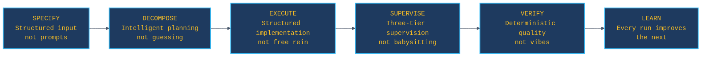
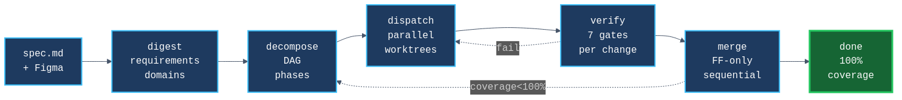
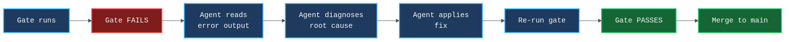

<!-- _class: cover -->

# SET

**Autonomous multi-agent orchestration for Claude Code**

Give it a spec. Get merged features.
*Greenfield or brownfield. Full app or single module.*

<!-- SPEAKER_NOTES:
SET takes a markdown specification and uses parallel AI agents to build
working applications. Today: intro to the system, then live demo.
-->

---

# The problem with AI coding today

 

> **Same prompt, different result.** Run it twice, get two different applications.
> Agents hallucinate features, skip requirements, and forget everything between sessions.

 

We tried "just prompting" agents to build apps. Results:

- 3 agents chose **3 different table libraries** for the same spec
- Cart feature shipped **without price calculation** (no one asked for it explicitly)
- LLM code review **let through a `TODO: implement later`** that broke checkout
- 15+ agent sessions, **zero voluntary memory saves** -- they never learn

 

**SET exists because prompting isn't engineering.**

<!-- SPEAKER_NOTES:
These are real examples from our first CraftBrew and MiniShop runs.
Not theoretical -- this is what happens when you give agents freedom
without structure, verification, or memory.
-->

---

# Six pillars -- what makes it work

 

| Pillar | In one sentence |
|--------|----------------|
| **SPECIFY** | Structured input with requirements + acceptance criteria, not vague prompts |
| **DECOMPOSE** | Intelligent planning into parallel changes with dependency DAG |
| **EXECUTE** | Iterative implementation in isolated git worktrees, not single-shot prompts |
| **SUPERVISE** | Three-tier supervision (sentinel > orchestrator > agents), 30s crash recovery |
| **VERIFY** | 7 deterministic gates -- exit codes, not LLM vibes |
| **LEARN** | Every run improves the next -- templates, memory hooks, cross-run learnings |

<!-- SPEAKER_NOTES:
These six pillars are the mental model. Every feature maps to one of these.
Each was born from a real failure that cost hours of compute.
-->

---

# The pipeline

 

**spec.md** is the input. The system digests it into requirements, decomposes into
independent changes, dispatches parallel agents, verifies each through 7 gates,
merges to main, and replans if coverage is under 100%.

**Fully autonomous.** The sentinel supervises everything -- crashes, stalls, budget.

<!-- SPEAKER_NOTES:
This is the full pipeline. Each stage is automatic. The sentinel is the
autonomous supervisor that handles infrastructure-level problems.
If something fails, the system diagnoses before it retries.
-->

---

# What it builds -- MiniShop

 

A complete **Next.js e-commerce app** -- product listing, cart, checkout, admin CRUD,
auth, seeded database. Built from a markdown spec + Figma design.

**6 changes | 1h 45m | 0 human interventions | 70 tests | 100% spec coverage**

<!-- SPEAKER_NOTES:
This is the hero result. Not scaffolding -- a working application with
real data, functional navigation, responsive layout. The agents wrote
38 Jest tests and 32 Playwright E2E tests as part of the implementation.
-->

---

# The numbers

 

6/6 changes merged
1h 45m wall clock
0 interventions
70 tests written
2.7M tokens total

 

| What | How |
|------|-----|
| **5 gate failures** | All self-healed -- agent reads error, fixes, re-runs gate |
| **83-87% convergence** | Run same spec twice, measure structural overlap |
| **100% schema match** | Data model is fully deterministic across runs |
| **26:1 cache ratio** | Prompt caching cuts actual cost dramatically |

 

> Roughly equivalent to **a day's work by 3-4 senior developers**.

---

# Self-healing -- it doesn't retry, it investigates

 

Real example from MiniShop: Playwright auth test expected redirect to `/login`,
but middleware redirected to `/admin/login`. The gate caught it, the agent
read the error, traced the middleware, updated 3 test files. No human involved.

**The system fixed a bug in SET's own code during an E2E run** -- and committed the fix
so it never happens again.

---

# Works everywhere

 

| | **Greenfield** | **Brownfield** | **Isolated unit** |
|---|---|---|---|
| **What** | Full app from spec + design | Your existing codebase | One module, one feature |
| **Example** | MiniShop: 6/6 merged, 1h 45m | SET builds itself: 1,500+ commits | "Add 3 API endpoints with auth" |
| **Pipeline** | 6-15 parallel changes | Same gates, reads existing code | Single change, full verification |

 

**The entry barrier is not a 30-page spec.** It can be a single task description.
The pipeline scales from a sentence to a specification.

> SET itself is built with SET -- 376 specs, every commit through the same pipeline.

---

# Scale -- from simple to complex

 

| | **micro-web** | **MiniShop** | **CraftBrew** |
|---|---|---|---|
| **Complexity** | 4 pages | E-commerce with admin | Multi-tenant, 28 DB tables |
| **Changes** | 3 | 6 | 15 |
| **Wall time** | ~20 min | 1h 45m | ~6h |
| **Tokens** | ~50K | 2.7M | ~11M |
| **Merge conflicts** | 0 | 0 | 4 (auto-resolved) |
| **Result** | 100% | 100% | 100% (run #7) |

 

**1,500+ commits | 134K LOC | 376 specs | 100+ E2E runs**

Built and used in production.

---

<!-- _class: divider -->

# Live demo

*Dashboard | Scaffolds | Pipeline in action*

<!-- SPEAKER_NOTES:
Now switch to the browser. Open http://localhost:7400.
Show the dashboard with a completed run.
Walk through: Changes tab, Phases, Tokens, Sessions, Sentinel.
Then show a scaffold: the micro-web spec, the generated code, the tests.
If time: start a fresh micro-web run and watch it live.
-->
