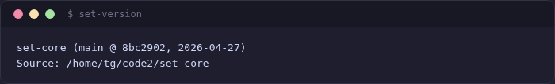
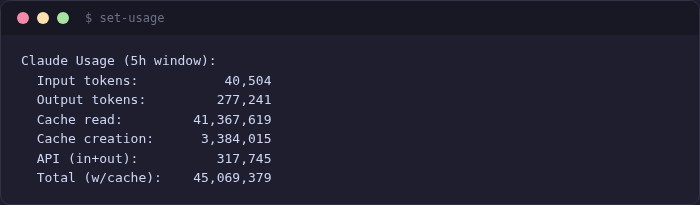

[< Back to INDEX](../INDEX.md)

# CLI Reference

Complete reference for all `set-*` commands shipped with set-core.

## Worktree Management

| Command | Description |
|---------|-------------|
| `set-new <change-id>` | Create new worktree + branch |
| `set-work <change-id>` | Open worktree in editor + Claude Code |
| `set-close <change-id>` | Close worktree (removes directory and branch) |
| `set-merge <change-id>` | Merge worktree branch back to main via integration gates |
| `set-add [path]` | Add existing repo or worktree to set-core |
| `set-list` | List all active worktrees |
| `set-status` | JSON status of all worktrees and agents |
| `set-focus <change-id>` | Focus editor window for a worktree |


### Examples

```bash
set-new add-auth              # create worktree for "add-auth" change
set-work add-auth             # open in editor with Claude Code
set-list                      # see all worktrees and their status
set-merge add-auth            # merge via dep-install -> build -> test -> e2e gates
set-close add-auth            # clean up after merge
```

## Project Management

| Command | Description |
|---------|-------------|
| `set-project init` | Register project + deploy hooks, commands, and skills to `.claude/` |
| `set-project list` | List registered projects |
| `set-project default <name>` | Set default project |

Always include `--project-type web --template nextjs` for web projects:

```bash
set-project init --name my-app --project-type web --template nextjs
```

## Orchestration

| Command | Description |
|---------|-------------|
| `set-orchestrate plan` | Generate change plan from spec/brief |
| `set-orchestrate plan --show` | Show existing plan |
| `set-orchestrate start` | Execute the plan (dispatch + monitor) |
| `set-orchestrate status` | Show current orchestration state |
| `set-orchestrate events [filters]` | Query event log (`--type`, `--change`, `--since`, `--last`, `--json`) |
| `set-orchestrate pause <name\|--all>` | Pause a change or all changes |
| `set-orchestrate resume <name\|--all>` | Resume a paused change or all |
| `set-orchestrate replan` | Re-plan from updated spec, preserving completed work |
| `set-orchestrate approve [--merge]` | Approve checkpoint / flush merge queue |

**Global options:** `--spec <path>`, `--brief <path>`, `--phase <hint>`, `--max-parallel <N>`, `--time-limit <dur>`


## Ralph Loop

| Command | Description |
|---------|-------------|
| `set-loop start [change-id]` | Start autonomous Claude Code loop |
| `set-loop stop [change-id]` | Stop running loop |
| `set-loop status [change-id]` | Show loop status |
| `set-loop list` | List all active loops |
| `set-loop history [change-id]` | Show iteration history |
| `set-loop monitor [change-id]` | Watch loop progress live |

## Sentinel Helpers

The sentinel is launched via the web UI or the `/set:sentinel` skill. These helpers support it:

| Command | Description |
|---------|-------------|
| `set-sentinel-finding` | Log bugs, patterns, and assessments during sentinel runs |
| `set-sentinel-inbox` | Check for messages from the user or other agents |
| `set-sentinel-log` | Structured sentinel event logging |
| `set-sentinel-status` | Register/heartbeat sentinel status for web UI |


## Team and Sync

| Command | Description |
|---------|-------------|
| `set-control` | Launch Control Center GUI |
| `set-control-init` | Initialize set-control team sync branch |
| `set-control-sync` | Sync member status (pull/push/compact) |
| `set-control-chat send <to> <msg>` | Send encrypted message |
| `set-control-chat read` | Read received messages |

## Developer Memory

| Command | Description |
|---------|-------------|
| `set-memory health` | Check if shodh-memory is available |
| `set-memory remember --type TYPE` | Save a memory (reads content from stdin) |
| `set-memory recall "query"` | Semantic search (`--mode MODE`, `--tags t1,t2`) |
| `set-memory list [--type TYPE] [--limit N]` | List memories with optional filters |
| `set-memory forget <id>` | Delete a single memory by ID |
| `set-memory forget --all --confirm` | Delete all memories |
| `set-memory forget --older-than <days>` | Delete memories older than N days |
| `set-memory forget --tags <t1,t2>` | Delete memories matching tags |
| `set-memory context [topic]` | Condensed summary by category |
| `set-memory brain` | 3-tier memory visualization |
| `set-memory get <id>` | Get a single memory by ID |
| `set-memory export [--output FILE]` | Export all memories to JSON |
| `set-memory import FILE [--dry-run]` | Import memories from JSON |
| `set-memory sync` | Push + pull memories via git remote |
| `set-memory sync push` | Push memories to shared team branch |
| `set-memory sync pull` | Pull memories from shared team branch |
| `set-memory sync status` | Show sync status (local vs remote counts) |
| `set-memory proactive` | Generate proactive context for current session |
| `set-memory stats` | Show memory statistics |
| `set-memory cleanup` | Delete low-importance and noisy memories |
| `set-memory migrate` | Run pending memory storage migrations |
| `set-memory repair` | Repair index integrity |
| `set-memory audit [--threshold N]` | Report duplicate clusters |
| `set-memory dedup [--threshold N]` | Remove duplicate memories |
| `set-memory status [--json]` | Show memory config, health, and count |
| `set-memory projects` | List all projects with memory counts |
| `set-memory metrics [--since Nd]` | Injection quality report |
| `set-memory dashboard [--since Nd]` | Generate HTML dashboard |
| `set-memory rules add --topics "t1,t2" "content"` | Add a deterministic rule |
| `set-memory rules list` | List rules |
| `set-memory rules remove <id>` | Remove a rule |


### Examples

```bash
echo "Always use pnpm, not npm" | set-memory remember --type Decision --tags "source:user,tooling"
set-memory recall "test command" --mode precise
set-memory forget --older-than 30
set-memory sync push
```

## OpenSpec

| Command | Description |
|---------|-------------|
| `set-openspec status [--json]` | Show OpenSpec change status |
| `set-openspec init` | Initialize OpenSpec in the project |
| `set-openspec update` | Update OpenSpec skills to latest version |


## Design

| Command | Description |
|---------|-------------|
| `set-figma-fetch <docs-dir>` | Scan docs for Figma URLs, fetch + assemble `design-snapshot.md` |
| `set-figma-fetch <url> -o <dir>` | Fetch a single Figma file |
| `set-figma-fetch --force <docs-dir>` | Re-fetch even if snapshots exist |
| `set-figma-fetch --reprocess <docs-dir>` | Re-assemble from existing raw data |

## Utilities

| Command | Description |
|---------|-------------|
| `set-config editor list` | List supported editors and availability |
| `set-config editor set <name>` | Set preferred editor |
| `set-usage` | Show Claude API token usage |
| `set-version` | Display version info (branch, commit, date) |
| `set-deploy-hooks <target-dir>` | Deploy Claude Code hooks to a directory |
| `set-audit scan` | Project health scan |
| `set-core` | Core orchestration server (`set-orch-core serve`) |
| `set-web-install` | Install web dashboard dependencies |
| `set-cleanup` | Clean up stale state files |
| `set-paths` | Show set-core directory paths |
| `set-restart-services` | Restart background services |
| `set-e2e-report` | Generate E2E run report |
| `set-discord-setup` | Configure Discord integration |





## Internal Scripts

These are called by other tools or by Claude Code hooks -- not for direct use:

- `set-common.sh` -- shared shell functions
- `set-hook-skill` -- UserPromptSubmit hook (skill tracking)
- `set-hook-stop` -- Stop hook (timestamp refresh + memory reminder)
- `set-hook-memory-recall` -- automatic memory recall on prompts
- `set-hook-memory-save` -- automatic memory save on session end
- `set-hook-memory-warmstart` -- session start memory warmup
- `set-hook-memory-pretool` -- pre-tool hot-topic recall
- `set-hook-memory-posttool` -- post-tool error recall
- `set-hook-activity` -- activity tracking hook
- `set-skill-start` -- register active skill for status display
- `set-control-gui` -- GUI launcher (called by `set-control`)
- `set-completions.bash` / `set-completions.zsh` -- shell completions
- `set-memory-hooks check/remove` -- legacy inline hook management
- `set-memoryd` -- memory daemon
- `set-manual` -- manual page viewer

---

<!-- Spec cross-references:
  - openspec/specs/worktree-management.md (set-new, set-work, set-close, set-merge)
  - openspec/specs/orchestration-engine.md (set-orchestrate)
  - openspec/specs/ralph-loop.md (set-loop)
  - openspec/specs/developer-memory.md (set-memory)
  - openspec/specs/team-sync.md (set-control)
-->

*See also: [Configuration](configuration.md) · [Architecture](architecture.md) · [Plugins](plugins.md)*

<!-- specs: worktree-tools, ralph-loop, orchestration-engine, memory-cli -->
